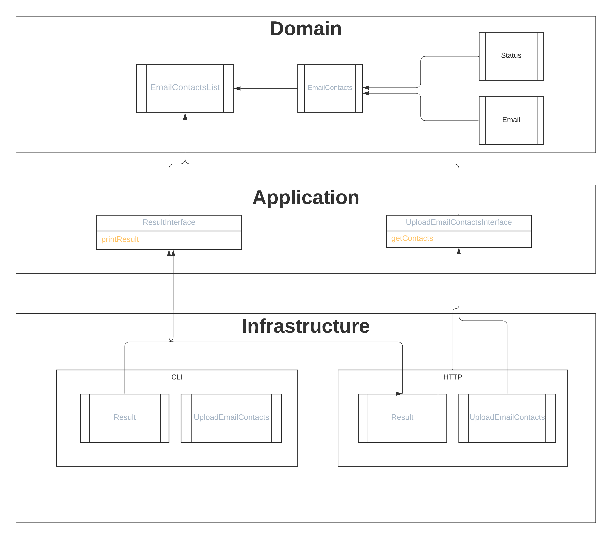

# Архитектура кода

В качестве улучшаемого проекта в данном случае возьмем домашнее задание по проверке списка email адресов на валидность:

https://github.com/otusteamedu/PHP_2022/tree/PShilyaev/hw6/OTUS_HW6

Написанное ранее приложение нарушает практически все принципы разработки, изученные в теме, оно сложно расширяемое и тестируемое. В качестве реальной бизнес-задачи такое приложение могло бы быть частью некого сервиса email рассылок по клиентам. Поэтому в данном домашнем задании ставится цель правильно написать такой начальный сервис, чтобы можно было потом дописывать функционал, не ломая и не модифицируя уже существующий и проверенные код.

На уровне Домена сразу напрашивается создание класса EmailContact, который будет содержать email подписчика. Подписчик может дать неверный email (сознательно или несознательно), поэтому перед получением новых данных требуется валидация значения email. В данном случае это будет происходить в том числе и с проверкой MX записей домена. В дальнейшем бизнес может захотеть периодически проверять существования подписчика и мы сможем добавить дату контрольного письма и статус подписчика: активен, невалидный email, спящий (получает, не читает, не отписывается), отписавшийся, пожаловавшийся и реализовать уже в слое приложения методы чистки базы подписчиков. Сюда же будут передаваться данные анализа отчетов DMARK (возможно некоторые домены принципиально не принимают нашу почту).

Для слоя Инфраструктуры напрашивается два сервиса, работающих с разными способами получения данных: CLI (командная строка) и HTTP (обычный веб сервис).

В самом же слое приложения будет непосредственно проверяться Email и записываться в хранилище (в данной работе не реализовано).
Если сравнивать с существующей реализацией приложения, то можно заменить, что никакие слои в приложении не выделены и дальнейшее развитие и тесты приложения очень затруднены.

UML диаграмма с основными интерфейсами и методами представлена на рисунке:

После реорганизации приложения существенно увеличилось число файлов, но также значительно возросла стабильность к изменениям и расширению функционала.

