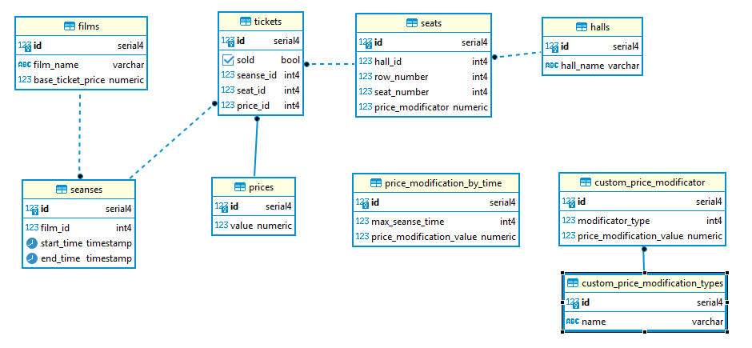

# Домашнее задание «Проектирование БД»

Цель:  спроектировать  схему данных для системы управления кинотеатром

## Описание реализации:

Кинотеатр состоит из нескольких залов (**halls**), каждый зал имеет схему расположения мест (**seats**), в которой указывается номер ряда и номер места и тип (VIP или обычное). Эти две таблицы относятся чисто к кинотеатру и практически не меняются в процессе работы кинотеатра. Зал может иметь произвольную конфигурацию, хоть овальный.

Фильмы, идущие в кинотеатре, хранятся в таблице **films**,  которая содержит название и id . От базовой стоимости предполагается на уровне приложения с учетом зала, типа места (VIP или обычное) и времени сеанса (**seanses**) рассчитывать стоимость конкретного билета и пускать билеты в продажу. 

Билеты (таблица **tickets**) заполняется при продаже билета. При этом цена берется из таблицы (**prices**). У каждой цены есть текстовое описание в таблице **price_description**. Соответственно, билет продается на конкретный сеанс (сеанс имеет связь с фильмом) и на конкретное место, которое уже связано с залом. Для проданных билетов не допускается изменение id цены.

Билет, соответственно, может быть продан или нет (после **sold**). В билете указывается дата, на которую он продан, фильм, ряд и место и цена (стоимость билетов в пределах зала отличается – дорогие по центру). 

Цена билета может быть установлена индивидуально вплоть до места и сеанса. Тип продажи (заранее, перед сеансом), наличие скидки у покупателя и т.д. учитывается уже в приложении и в таблицу уже записывается фактическая цена билета.

Наглядно схема показана на диаграмме:



При такой логической организации БД запро на нахождение самого прибыльного фильма будет выглядеть так:

```sql
select f.film_name, SUM(p.value) as SUMM  from tickets t 
left join seanses s on s.id = t.seanse_id 
left join films f on f.id = s.film_id 
left join prices p on p.id = t.price_id  
group by f.film_name
order by SUMM desc
limit 1;
```

DDL схема приведена в отдельном файле.
