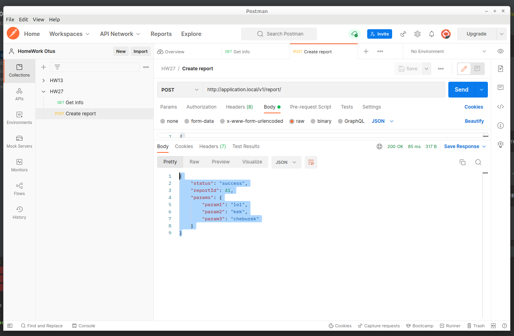

## Что это ?
Домашнее задание из курса ["Otus PHP Professional"](https://fas.st/wRyRs) №17, "Реализация API"

### Цель 
Научиться создавать универсальный интерфейс для различных потребителей 
(frontend фреймворки, мобильные приложения, сторонние приложения)

### Описание/Пошаговая инструкция выполнения домашнего задания:
1. Необходимо реализовать Rest API с использованием очередей.
2. Ваши клиенты будут отправлять запросы на обработку, а вы будете складывать их в очередь и возвращать номер запроса.
3. В фоновом режиме вы будете обрабатывать запросы, а ваши клиенты периодически, используя номер запроса, будут проверять статус его обработки.

### Разрешается
* Использование Composer-зависимостей
* Использование микро-фреймворков (Lumen, Silex и т.п.)

____________

## Описание API

### API энтрипоинты:

- `POST /v1/report/` - отправка данных в очередь. Придет в ответе идентификатоор задачи
- `GET  /v1/report/{id}` - получение данных отчета
- `GET  /v1/report/{id}/status` - получение состояния обработки отчета

____________

### Статусы очереди и расшифровка

- `ready` - готов к обработке в очереди 
- `in_queue` - обрабатывается в очереди
- `success` - задача обработана успешно, можно забирать результат работы
- `error` - задача обработана с ошибкой, вывод ошибки

____________

### Инструкция по деплойменту

```
# clone sources
git clone https://github.com/otusteamedu/PHP_2022.git
cd PHP_2022/
git checkout MIkonnikov_hw17_api

# setup vendor libs
cd code 
mv .env.example .env
# + Настроить почтовик под себя: указать логин, пароль, MAIL_FROM_ADDRESS

# setup vendor libs
composer update

# build container
cd ../
docker-compose build
docker-compose up -d

# check that all works fine
docker-compose ps

# run migrations in app/fpm container
docker exec -it homework-app bash
php artisan migrate
# run rabbitMQ listener:
php artisan rabbit

# run in worksapce:
docker exec -it homework-workspace bash
make console
```

5. загрузить в Postman коллекцию из docs/postman_collection.json

### Инструкция по тестированию API

**Запрос POST** 
- http://application.local/v1/report/

отправляем тело запроса: 

```json
{
    "param1": "lol",
    "param2": "kek",
    "param3": "cheburek"
}
```
получаем ответ:

```json
{
    "status": "ready",
    "reportId": 41,
    "params": {
        "param1": "lol",
        "param2": "kek",
        "param3": "cheburek"
    }
}
```

`"status": "ready",` в теле ответа - говорит о том, 
что текущая задача с отчетом готова к обработке фоновым процессов в очереди. 

а в контейнере workspace при запущенном фоновом скрипте:
`cli:report-queue` 
- произойдет подключение к RabbiotMQ и отчет обработается 
- в разные моменты в БД будет изменяться статус задачи



**Запрос GET** 
- http://application.local/v1/report/41/status 
- получение статуса задачи:

```json
{
    "reportId": 41,
    "status": "success",
    "created_at": "2022-06-12 19:49:46"
}
```

По окончанию выполнения задачи на почту, 
которая была указана в конфиге `.env` 
в параметре **MAIL_FROM_ADDRESS** придет сообщение о готовом отчете.
- Пример: 
```
Ваш отчет был сформирован!
Номер отчета: 41
```