# Курс OTUS PHP_2022, ДЗ к Уроку №13: Redis  

## Автор
Mikhail Ikonnikov , mishaikon@gmail.com

## Задача

### Цель
Научиться взаимодействовать с Redis.

### Описание/пошаговая инструкция выполнения домашнего задания

Аналитик хочет иметь систему со следующими возможностями:
- Система должна хранить события, которые в последующем будут отправляться сервису событий
- События характеризуются важностью (аналитик готов выставлять важность в целых числах)
- События характеризуются критериями возникновения. 
- Событие возникает только если выполнены все критерии его возникновения. 
- Для простоты все критерии заданы так:
``` 
<критерий>=<значение> 
```
- Таким образом предположим, что аналитик заносит в систему следующие события:
``` 
{ priority: 1000, conditions: { param1 = 1 }, event: { ::event:: }, }, 
{ priority: 2000, conditions: { param1 = 2, param2 = 2 }, event: { ::event:: }, }, 
{ priority: 3000, conditions: { param1 = 1, param2 = 2 }, event: { ::event:: }, },
```
- От пользователя приходит запрос:
``` 
{ params: { param1 = 1, param2 = 2 } }
```
- Под этот запрос подходят первая и третья запись, т.к. в них обеих выполнены все условия, 
но приоритетнее третья, так как имеет больший priority.

### Требуется 
Написать систему, которая будет уметь:
- добавлять новое событие в систему хранения событий
- очищать все доступные события
- отвечать на запрос пользователя наиболее подходящим событием
- использовать для хранения событий redis

### Критерии оценки
- Желательно параллельно попрактиковаться и выполнить ДЗ в других NoSQL хранилищах
- Слой кода, отвечающий за работу с хранилищем должен позволять легко менять хранилище

------------------------------------------

### Установка
- чекаут исходников
``` 
git clone https://github.com/otusteamedu/PHP_2022.git
cd PHP_2022
git checkout MIkonnikov/hw13

# setup redis/memcached extesions (if required)
apt-get install php-redis
apt-get install php-memcached

# download/update vendor libs
composer update
```
- переименовать файл ```.env.example``` в файл ```.env``` 
- выполнить:
```docker-compose build```
- как сборка завершится, выполнить:
```docker-compose up -d```
(будут созданы контейнеры) 

### Настройка
- зайдя в контейнер ```otus-hw11``` выполнить ```chmod +x analytics_panel.php```
- Доступна работа с двумя NoSQL БД - ```Memcached``` и ```Redis```. 
- Переключение осуществляется путем изменения значения параметра ```repository``` 
- в конфиг. файле ```app\src\config\common.php```  

### Взаимодействие с системой через консоль  
- Работа с системой возможна через ```HTTP API``` и ```Cli API```
- Для работы через командную строку нужно зайти в контейнер ```otus-hw11```:
```
docker exec -it otus-hw11  bash
``` 
- и выполнить ```./analytics_panel.php```. 
- Дальше просто выбирать пункты пределагаемые системой
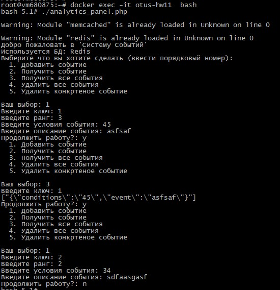
 
### Взаимодействие с системой через API 
(*) рекомендую использовать [Postman](https://www.postman.com/downloads/).

Для работы через ```HTTP API``` предусмотрены следующие ```url```:
- ```/api/event/add``` - добавление события: ```{"key":"event", "score":1000, "conditions":"param=1,param=2", "event_description":"event1"}```  
- ```/api/event/get``` - получения конкретного события: ```{"key":"event", "conditions":"param=1,param=2", "event_description":"event1"}```  
- ```/api/event/get_all``` - получения всех добавленных событий: ```{"key":"event"}```  
- ```/api/event/delete``` - удаление конкретного события: ```{"key":"event", "conditions":"param=1,param=2", "event_description":"event1"}```  
- ```/api/event/delete_all``` - удаление всех событий: ```{"key":"event"}```  
- Все запросы и ответы от ```HTTP API``` в ```JSON```
- Результатом поиска и удаления всегда будет событие соответствуюшие заданным условиям поиска, но с максимальным рангом (```score```)
  (*) Пример тестирования через Postman:
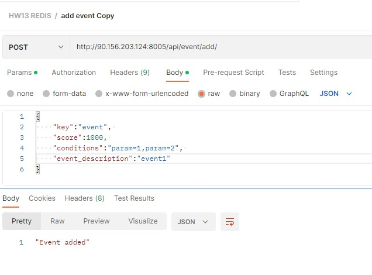

(!) Для тестирования можно также использовать тестовую площадку онлайн:
http://90.156.203.124:8005/

### Примеры работы через консольное приложение
- Начало:  
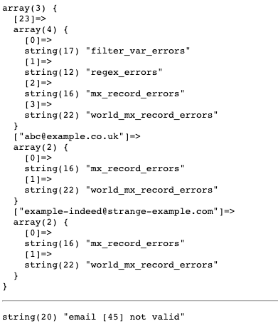  
- Событий нет:  
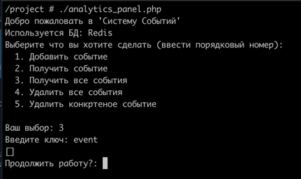  
- Начинаем добавлять:  
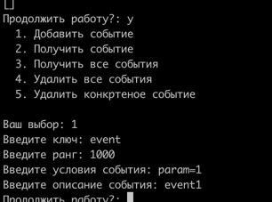  
- Продолжаем:  
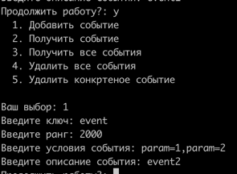  
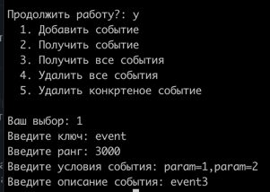  
- Проверяем что события добавлены:  
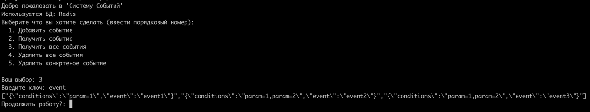  
- Получаем событие:  
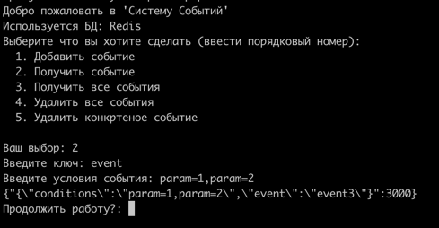   
  
- Удалим второе событие:  
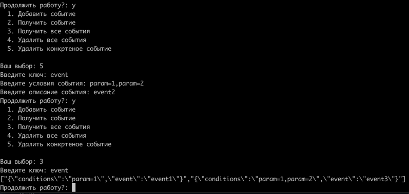  
- Удалим все события:  
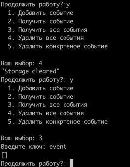  

### Примеры работы через HTTP API  
- Переключимся на Memcached (проверим через консольное приложение):  
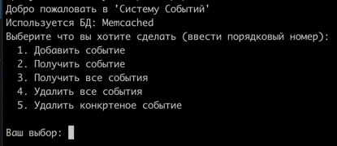  
- Проверим что событий нет:  
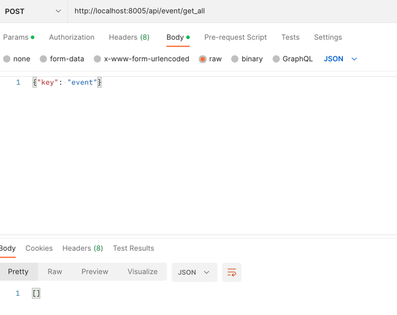  
- Начинаем добавлять: 
```
{
    "key":"event", 
    "score":1000, 
    "conditions":"param=1", 
    "event_description":"event1"
}
``` 
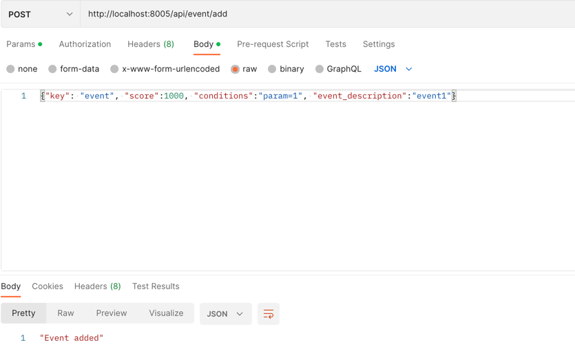  
- Продолжаем:  
```
{
    "key":"event", 
    "score":2000, 
    "conditions":"param=1,param2", 
    "event_description":"event2"
}
``` 
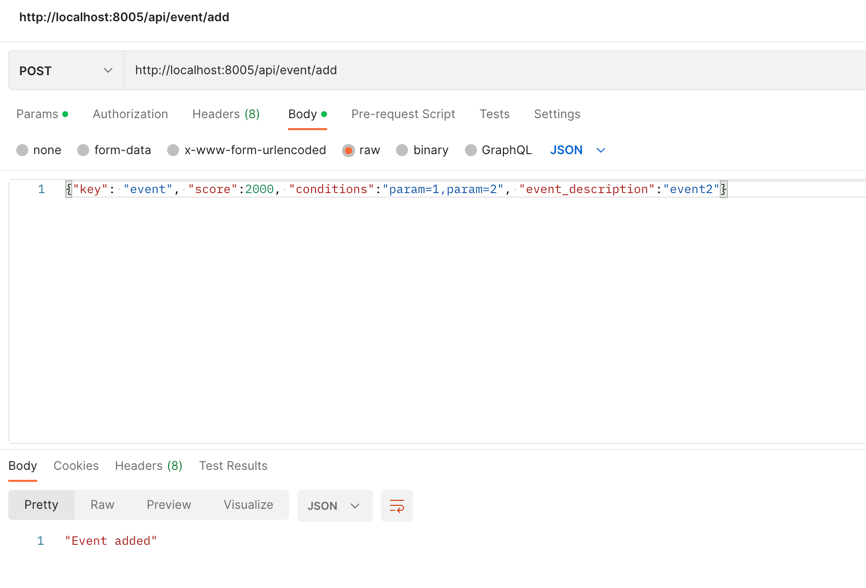
```
{
    "key":"event", 
    "score":3000, 
    "conditions":"param=1,param2", 
    "event_description":"event3"
}
```
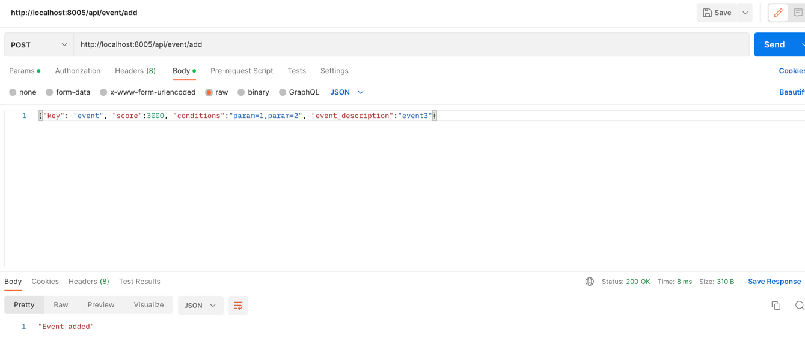  
- Проверяем что события добавлены:  
```
{
    "key": "event"
}
``` 
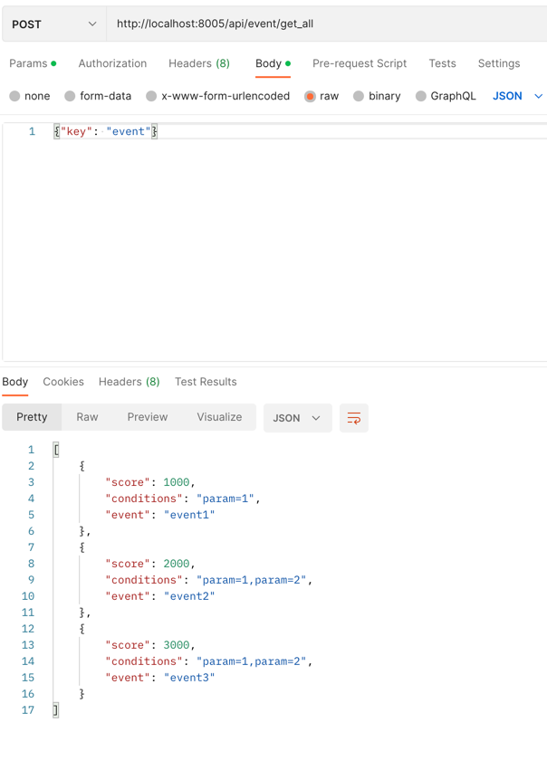  
```
[
    "{\"conditions\":\"param=1\",\"event\":\"event1\"}",
    "{\"conditions\":\"param=1,param2\",\"event\":\"event2\"}",
    "{\"conditions\":\"param=1,param2\",\"event\":\"event3\"}"
]
``` 
- Получаем событие:  
```
{
    "key": "event",
    "conditions": "param1,param2"
}
``` 
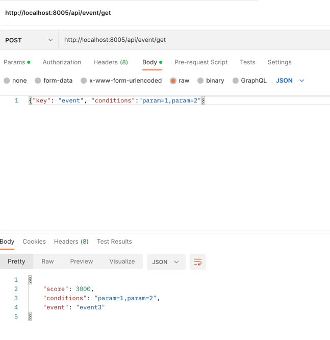  
- Получаем другое событие:
```
{
    "key": "event",
    "conditions": "param1"
}
``` 
  
- Удаляем второе событие:  
```
{
    "key":"event", 
    "score":2000, 
    "conditions":"param=1,param2", 
    "event_description":"event2"
}
``` 
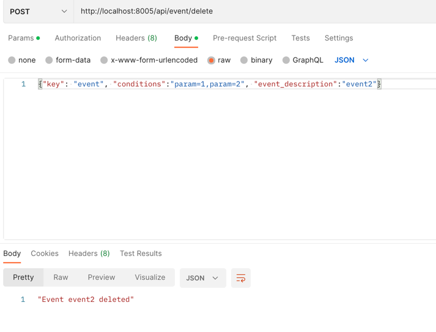  
- Проверяем:  
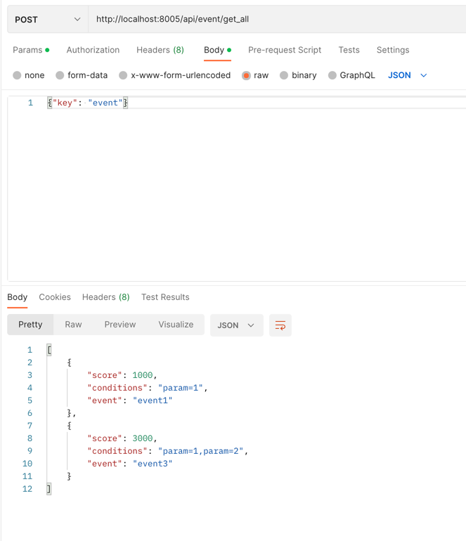  
- Удалим все события:  
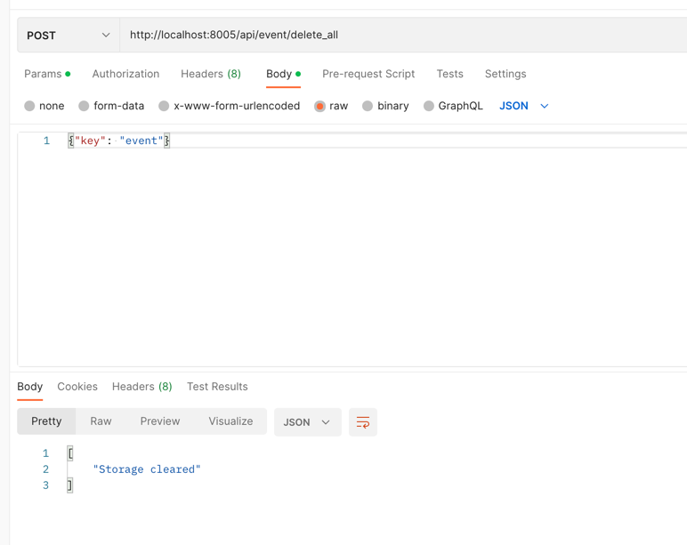  
- Проверяем:  
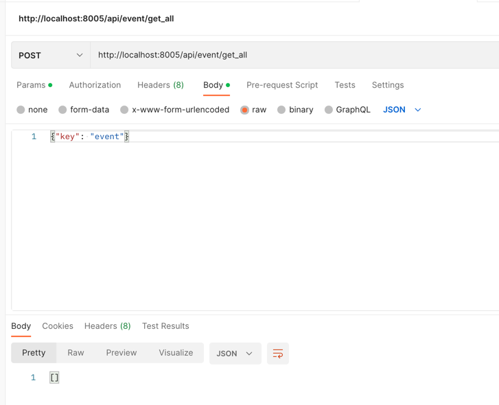  
