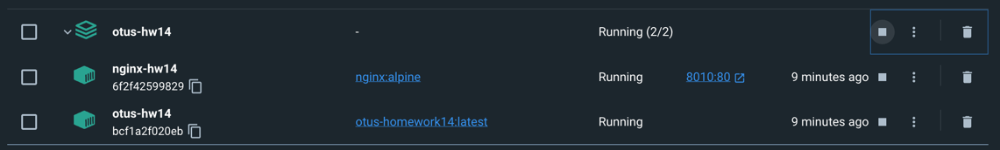

# PHP_2022

## ДЗ: Паттерны проектирования

#### Разрабатываем часть интернет-ресторана. Продаёт он фаст-фуд.

1. Абстрактная фабрика будет отвечать за генерацию базового продукта-прототипа: бургер, сэндвич или хот-дог
2. При готовке каждого типа продукта Декоратор будет добавлять составляющие к базовому продукту либо по рецепту, либо по пожеланию клиента (салат, лук, перец и т.д.)
3. Наблюдатель подписывается на статус приготовления и отправляет оповещения о том, что изменился статус приготовления продукта.
4. Прокси используется для навешивание пре и пост событий на процесс готовки. Например, если бургер не соответствует стандарту, пост событие утилизирует его.
5. Стратегия будет отвечать за то, что нужно приготовить.
6. Все сущности должны по максимуму генерироваться через DI.

#### Запуск.

1. Склонировать проект.
2. Из директории куда склонирован проект выполнить ```docker-compose build```.
3. Если сборка прошла успешно, там же выполнить ```docker-compose -p 'otus-hw14' up -d```.
4. Если не было ошибок создадутся два контейнера:  

5. Зайти в контейнер ```otus-hw14```, перейти в директорию ```/src``` и там выполнить ```chmod +x app.php```.
6. Выполнить ```./app.php``` - приложение запущено.

#### Примеры работы.
- создание продукта  

- утилизация продукта  
