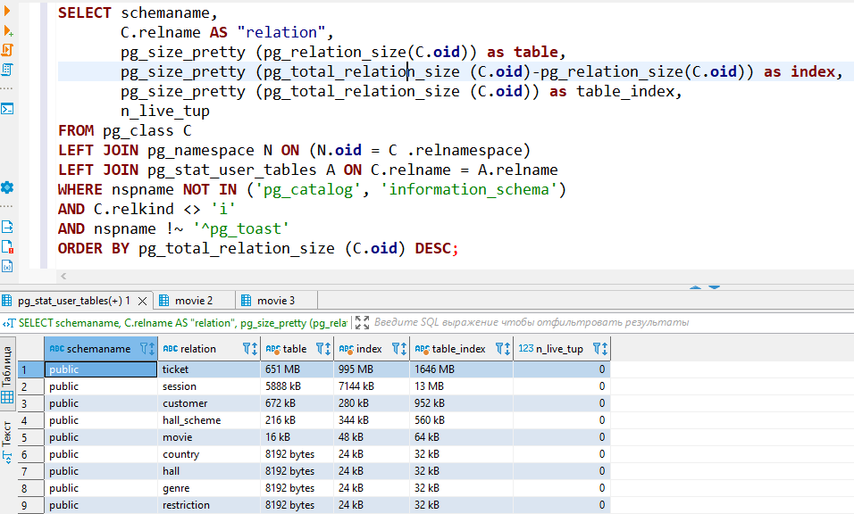
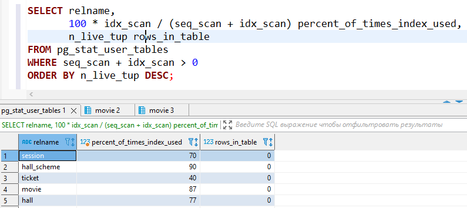

# PHP_2022

## 1. Скрипт создания БД
Файл 01_DDL.sql

## 2. Скрипт наполнения БД тестовыми данными
Файл 02_DML.sql  
Тестовый стенд включает в себя наполнение:  
    100 Фильмов  
    10000 Клиентов  
На первом этапе:  
    1000 Сеансов  
    100000 Билетов  
На втором этапе:  
    100000 Сеансов  
    10000000 Билетов  

## 3. Таблица с результатами
| Запрос | 10000+ записей | 100000000+ записей | 100000000+ записей с оптимизацией |
| --- | --- | --- | --- |
| Выбор всех фильмов на сегодня | 0.179 ms | 30.054 ms | 0.057 ms |
| Подсчёт проданных билетов за неделю | 43.520 ms | 4460.375 ms | 659.925 ms |
| Формирование афиши | 0.309 ms | 38.281 ms | 6.509 ms |
| Поиск 3 самых прибыльных фильмов за неделю | 17.117 ms | 1286.161 ms | 1251.353 ms |
| Сформировать схему зала и показать на ней свободные и занятые места на конкретный сеанс | 1.145 ms | 3.399 ms | 1.359 ms |
| Вывести диапазон миниальной и максимальной цены за билет на фильмы этой недели | 0.657 ms | 23.931 ms | 10.028 ms |

## 4. Перечень оптимизаций
Добавление индексов на таблицы (см. файл 03_Queries.sql)
1. Таблица session на столбцы start_time, movie_id, hall_id
2. Таблица ticket на столбцы created_at, session_id
3. Таблица hall_scheme на столбцы hall_id

## 5. Список объектов БД
Объекты и их размер на диске  

Процент использования индексов  
