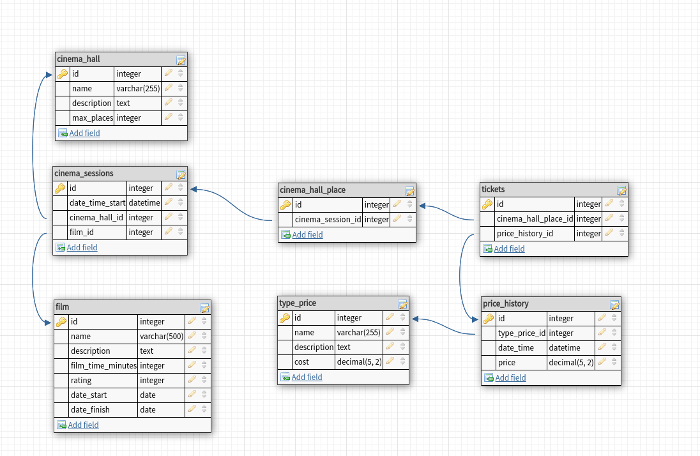

# PHP_2022

https://otus.ru/lessons/razrabotchik-php/?utm_source=github&utm_medium=free&utm_campaign=otus

# !!! Осторожно c файлом /dump/dump.sql - может быть 1 миллион записей в таблицах !!!
Они будут созданы из генеративных циклов в /dump/dump.sql. Данный файл будет отработан один раз, при первичном создании БД. 


### Выводы по архитектуре:

1. Созданая архитектура БД, не оптимальна, много транзитивных связей и зависимостей. Сильно усложнилась генерация тестовых данных. Принял решение сразу изменить архитектуру на получше. 

2. Переработал архитектуру БД. Убрал транзитивные зависимости.


### Выводы по домашнему заданию:
 - Выполнение запросов к БД на 10000 записей в таблицах:
   - без индексов
   - с индексами
 - Выполнение запросов к БД на 10000000 записей в таблицах:
   - без индексов
   - с индексами

# Анализ работы запросов

### Запрос 1
```SQL
explain analyse select type_price_id, date_time, price from price_history where date_time between '2022-03-27 06:42:25.175462' AND '2022-03-27 15:01:25.175462';
```

- без индексов:
```SQL
Seq Scan on price_history  (cost=0.00..214.00 rows=499 width=18) (actual time=0.022..1.573 rows=500 loops=1)
  Filter: ((date_time >= '2022-03-27 06:42:25.175462'::timestamp without time zone) AND (date_time <= '2022-03-27 15:01:25.175462'::timestamp without time zone))
  Rows Removed by Filter: 9500
Planning Time: 0.168 ms
Execution Time: 1.637 ms
```

- с индексами:
```SQL
Seq Scan on price_history  (cost=0.00..214.00 rows=499 width=18) (actual time=0.015..1.286 rows=500 loops=1)
  Filter: ((date_time >= '2022-03-27 06:42:25.175462'::timestamp without time zone) AND (date_time <= '2022-03-27 15:01:25.175462'::timestamp without time zone))
  Rows Removed by Filter: 9500
Planning Time: 0.061 ms
Execution Time: 1.332 ms
```

### Запрос 2
```SQL
explain analyse select type_price_id, date_time, price from price_history where price < 700;
```

- без индексов:
```SQL
Seq Scan on price_history  (cost=0.00..189.00 rows=8706 width=18) (actual time=0.007..1.917 rows=8706 loops=1)
  Filter: (price < '700'::numeric)
  Rows Removed by Filter: 1294
Planning Time: 0.092 ms
Execution Time: 2.211 ms
```

- с индексами:
```SQL
Seq Scan on price_history  (cost=0.00..189.00 rows=8706 width=18) (actual time=0.012..3.449 rows=8706 loops=1)
  Filter: (price < '700'::numeric)
  Rows Removed by Filter: 1294
Planning Time: 0.090 ms
Execution Time: 4.117 ms
```

### Запрос 3
```SQL
explain analyse select name, description from film where name like '%а%';
```

### Запрос 4
```SQL
explain analyse select count(film) from film
   left join cinema_sessions cs on film.id = cs.film_id
   left join cinema_hall_place chp on cs.id = chp.cinema_session_id
   left join tickets t on chp.id = t.cinema_hall_place_id
   left join price_history ph on t.price_history_id = ph.id
   left join type_price tp on ph.type_price_id = tp.id
   where film.name like '%а%';
```
Без индексов
```SQL
Aggregate  (cost=1104.44..1104.45 rows=1 width=8) (actual time=23.752..23.752 rows=1 loops=1)
  ->  Hash Left Join  (cost=815.45..1096.11 rows=3333 width=592) (actual time=18.325..23.328 rows=10229 loops=1)
        Hash Cond: (ph.type_price_id = tp.id)
        ->  Hash Right Join  (cost=802.53..1037.36 rows=3333 width=596) (actual time=17.880..21.804 rows=10229 loops=1)
              Hash Cond: (ph.id = t.price_history_id)
              ->  Seq Scan on price_history ph  (cost=0.00..164.00 rows=10000 width=8) (actual time=0.037..0.699 rows=10000 loops=1)
              ->  Hash  (cost=760.87..760.87 rows=3333 width=596) (actual time=17.787..17.787 rows=10229 loops=1)
                    Buckets: 16384 (originally 4096)  Batches: 1 (originally 1)  Memory Usage: 2555kB
                    ->  Hash Right Join  (cost=535.03..760.87 rows=3333 width=596) (actual time=11.617..15.215 rows=10229 loops=1)
                          Hash Cond: (t.cinema_hall_place_id = chp.id)
                          ->  Seq Scan on tickets t  (cost=0.00..155.00 rows=10000 width=8) (actual time=0.015..0.828 rows=10000 loops=1)
                          ->  Hash  (cost=493.37..493.37 rows=3333 width=596) (actual time=11.577..11.577 rows=10229 loops=1)
                                Buckets: 16384 (originally 4096)  Batches: 1 (originally 1)  Memory Usage: 2555kB
                                ->  Hash Right Join  (cost=277.54..493.37 rows=3333 width=596) (actual time=4.919..8.837 rows=10229 loops=1)
                                      Hash Cond: (chp.cinema_session_id = cs.id)
                                      ->  Seq Scan on cinema_hall_place chp  (cost=0.00..145.00 rows=10000 width=8) (actual time=0.011..0.746 rows=10000 loops=1)
                                      ->  Hash  (cost=235.88..235.88 rows=3333 width=596) (actual time=4.885..4.885 rows=7511 loops=1)
                                            Buckets: 8192 (originally 4096)  Batches: 1 (originally 1)  Memory Usage: 1853kB
                                            ->  Hash Right Join  (cost=1.05..235.88 rows=3333 width=596) (actual time=0.079..2.709 rows=7511 loops=1)
                                                  Hash Cond: (cs.film_id = film.id)
                                                  ->  Seq Scan on cinema_sessions cs  (cost=0.00..164.00 rows=10000 width=8) (actual time=0.010..1.238 rows=10000 loops=1)
                                                  ->  Hash  (cost=1.04..1.04 rows=1 width=596) (actual time=0.043..0.044 rows=2 loops=1)
                                                        Buckets: 1024  Batches: 1  Memory Usage: 9kB
                                                        ->  Seq Scan on film  (cost=0.00..1.04 rows=1 width=596) (actual time=0.035..0.037 rows=2 loops=1)
                                                              Filter: ((name)::text ~~ '%а%'::text)
                                                              Rows Removed by Filter: 1
        ->  Hash  (cost=11.30..11.30 rows=130 width=4) (actual time=0.416..0.416 rows=6 loops=1)
              Buckets: 1024  Batches: 1  Memory Usage: 9kB
              ->  Seq Scan on type_price tp  (cost=0.00..11.30 rows=130 width=4) (actual time=0.383..0.388 rows=6 loops=1)
Planning Time: 0.695 ms
Execution Time: 24.310 ms
```

С индексами 
```SQL
Aggregate  (cost=1062.92..1062.93 rows=1 width=8) (actual time=23.578..23.578 rows=1 loops=1)
  ->  Hash Left Join  (cost=739.56..1054.59 rows=3333 width=592) (actual time=13.030..23.136 rows=10229 loops=1)
        Hash Cond: (ph.type_price_id = tp.id)
        ->  Nested Loop Left Join  (cost=738.43..1007.62 rows=3333 width=596) (actual time=13.015..21.962 rows=10229 loops=1)
              ->  Seq Scan on film  (cost=0.00..1.04 rows=1 width=596) (actual time=0.019..0.029 rows=2 loops=1)
                    Filter: ((name)::text ~~ '%а%'::text)
                    Rows Removed by Filter: 1
              ->  Hash Right Join  (cost=738.43..973.26 rows=3333 width=8) (actual time=8.890..10.610 rows=5114 loops=2)
                    Hash Cond: (ph.id = t.price_history_id)
                    ->  Seq Scan on price_history ph  (cost=0.00..164.00 rows=10000 width=8) (actual time=0.006..0.514 rows=10000 loops=2)
                    ->  Hash  (cost=696.76..696.76 rows=3333 width=8) (actual time=8.858..8.858 rows=5114 loops=2)
                          Buckets: 4096  Batches: 1  Memory Usage: 158kB
                          ->  Hash Right Join  (cost=470.93..696.76 rows=3333 width=8) (actual time=5.951..8.226 rows=5114 loops=2)
                                Hash Cond: (t.cinema_hall_place_id = chp.id)
                                ->  Seq Scan on tickets t  (cost=0.00..155.00 rows=10000 width=8) (actual time=0.007..0.611 rows=10000 loops=2)
                                ->  Hash  (cost=429.27..429.27 rows=3333 width=8) (actual time=5.936..5.936 rows=5114 loops=2)
                                      Buckets: 4096  Batches: 1  Memory Usage: 158kB
                                      ->  Hash Right Join  (cost=213.44..429.27 rows=3333 width=8) (actual time=2.143..5.056 rows=5114 loops=2)
                                            Hash Cond: (chp.cinema_session_id = cs.id)
                                            ->  Seq Scan on cinema_hall_place chp  (cost=0.00..145.00 rows=10000 width=8) (actual time=0.014..0.778 rows=10000 loops=2)
                                            ->  Hash  (cost=171.78..171.78 rows=3333 width=8) (actual time=2.105..2.105 rows=3756 loops=2)
                                                  Buckets: 4096  Batches: 1  Memory Usage: 128kB
                                                  ->  Bitmap Heap Scan on cinema_sessions cs  (cost=66.12..171.78 rows=3333 width=8) (actual time=0.227..1.196 rows=3756 loops=2)
                                                        Recheck Cond: (film.id = film_id)
                                                        Heap Blocks: exact=128
                                                        ->  Bitmap Index Scan on cinema_sessions_film_id_index  (cost=0.00..65.28 rows=3333 width=0) (actual time=0.209..0.209 rows=3756 loops=2)
                                                              Index Cond: (film.id = film_id)
        ->  Hash  (cost=1.06..1.06 rows=6 width=4) (actual time=0.007..0.007 rows=6 loops=1)
              Buckets: 1024  Batches: 1  Memory Usage: 9kB
              ->  Seq Scan on type_price tp  (cost=0.00..1.06 rows=6 width=4) (actual time=0.002..0.003 rows=6 loops=1)
Planning Time: 0.748 ms
Execution Time: 23.716 ms
```

### Запрос 5
```SQL
explain analyse select count(film) from film
    left join cinema_sessions cs on film.id = cs.film_id
    left join cinema_hall_place chp on cs.id = chp.cinema_session_id
    left join tickets t on chp.id = t.cinema_hall_place_id
    left join price_history ph on t.price_history_id = ph.id
    left join type_price tp on ph.type_price_id = tp.id
where date_time between '2022-03-27 06:42:25.175462' AND '2022-03-27 15:01:25.175462';
```

### Запрос 6
```SQL
explain analyse select count(film) from film
    left join cinema_sessions cs on film.id = cs.film_id
    left join cinema_hall_place chp on cs.id = chp.cinema_session_id
    left join tickets t on chp.id = t.cinema_hall_place_id
    left join price_history ph on t.price_history_id = ph.id
    left join type_price tp on ph.type_price_id = tp.id
where price > 800 AND date_time between '2022-03-27 06:42:25.175462' AND '2022-03-27 15:01:25.175462';
```

| Номер запроса | без индексов 10к записей | с индексами 10к записей | без индексов 1млн записей | с индексами 1млн записей |
|---------------|--------------------------|-------------------------|---------------------------|--------------------------|
| 1             | 0.168 / 1.637 ms         | 0.061 / 1.332 ms        | 0.182 / 32.093 ms         | 0.506 / 0.378 ms         |
| 2             | 0.092 / 2.211 ms         | 0.090 / 4.117 ms        | 0.062 / 155.917 ms        | 0.085 ms / 155.484 ms    |
| 3             | 0.092 / 2.211 ms         | 0.187 / 0.020 ms        | 0.142 / 0.088 ms          | 0.216 ms / 0.018 ms      |
| 4             | 0.695 / 24.310 ms        | 0.748 / 23.716 ms       | out of memory             | 0.514 ms / 44020.528 ms  |
| 5             | 0.594 / 11.131 ms        | 0.446 / 6.060 ms        | 0.459 / 143.487 ms        | 1.334 ms / 46.168 ms     |
| 6             | 0.465 / 10.485 ms        | 0.384 / 4.485 ms        | 0.222 / 141.864 ms        | 0.423 ms / 46.928 ms     |

Сложные запросы будут иметь одинаковый набор left join чтобы выполнить полезную нагрузку по аналитике данных, поэтому смысл сочинять что-то сверх не имеет

# Анализ производительности БД.

Были составлены 3 простых запроса и 3 сложных. Произведен анализ используя explain и analyse, выписана табличка с показаниями выполнения запросов.

**Выводы**: без индексов запросы выполняются медленнее, ощутимие всего - на 1000000 записей в таблицах. Есть тяжелый запрос, который без индексов сожрал всю допустимую память и выпал с ошибкой.

**Вывод по оптимизации запросов**: Кроме указания первичных индексов, были добавлены в индексы поля, по которым искались данные или по которым происходило сравнение в Left join.

```SQL
alter table price_history
            add constraint price_history_pk
                primary key (id);

alter table type_price
            add constraint type_price_pk
                primary key (id);

alter table film
            add constraint film_pk
                primary key (id);

create index film_name_index
            on film (name);

create index film_date_start_date_finish_index
            on film (date_start, date_finish);

create index tickets_price_history_id_index
            on tickets (price_history_id);

create index tickets_cinema_hall_place_id_index
            on tickets (cinema_hall_place_id);

-- Индекс нужен для запросов на дату и диапазон дат в поисковых запросах
create index cinema_sessions_date_time_start_index
            on cinema_sessions (date_time_start);

create index cinema_sessions_film_id_index
            on cinema_sessions (film_id);

alter table cinema_hall_place
            add constraint cinema_hall_place_pk
                primary key (id);

create index cinema_hall_place_cinema_session_id_index
            on cinema_hall_place (cinema_session_id);

alter table cinema_hall
            add constraint cinema_hall_pk
                primary key (id);

create index price_history_price_index
            on price_history (price);

-- Индекс нужен для запросов на дату и диапазон дат в поисковых запросах
create index price_history_date_time_index
            on price_history (date_time);
```

**Выводы**: После добавления индексов, самый дорогой по ресурсам запрос не выжрал память и за 44 секунды смог вычислить полезные данные. Скорость обработки запросов с индексами увеличилась в несколько раз относительно таблиц, у которых было 1 млн записей. В таблицах где было мало записей, время работы практически не менялось. Индексы нужны больше всего на тех таблицах, где хранится большое количество данных. 

Пример сложных запросов:

- Самый прибыльный фильм
```SQL
select film.name, sum(ph.price) as price from film
  left join cinema_sessions cs on film.id = cs.film_id
  left join cinema_hall_place chp on cs.id = chp.cinema_session_id
  left join tickets t on chp.id = t.cinema_hall_place_id
  left join price_history ph on t.price_history_id = ph.id
  left join type_price tp on ph.type_price_id = tp.id
GROUP BY film.name
ORDER BY price DESC LIMIT 1;
```

- Список фильмов на определенный диапазон времени:
```SQL
select film.name, cs.date_time_start as price from film
    left join cinema_sessions cs on film.id = cs.film_id
where cs.date_time_start between '2022-03-27 00:00:00' AND '2022-03-27 23:00:00';
```

- Получение занятых мест на определенный сеанс фильма
```SQL
select film.name, count(chp.id) from film
  left join cinema_sessions cs on film.id = cs.film_id
  left join cinema_hall_place chp on cs.id = chp.cinema_session_id
where cs.id = 21
GROUP BY film.name;
```
# Настройки по работе с PgAdmin

## PgAdmin (адрес и креды для PgAdmin)
 - URL: http://localhost:8081/   
 - login: admin@admin.com
 - password: root


## Connection settings:  (Настройки для PgAdmin контейнера)
 - Host: postgres
 - Port: 5432
 - DB: cinema
 - Username: root
 - Password: root
 