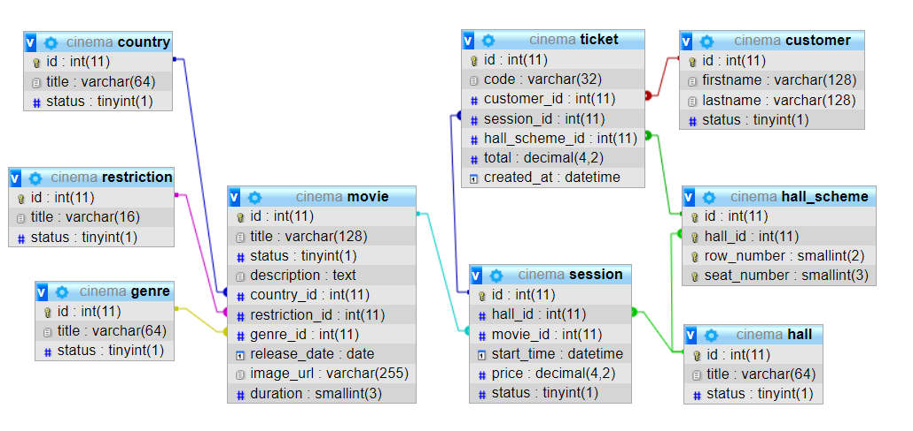

# Проектирование БД "Кинотеатр"

В данной БД реализован функционал покупки билетов в кинотеатре.   
Кинотеатр имеет несколько залов, в каждом зале идет несколько разных сеансов, клиенты могут купить билеты на сеансы

## Схема БД

## Таблицы БД
### country - Список стран производителей кинофильмов
| Наименование поля | Тип поля | Примечания
| --- | --- | --- |
| id | INT(11) | NOT NULL, PK |
| title | VARCHAR(64) | NOT NULL |
| status | TINYINT(1) | NOT NULL |
### customer - Гости кинотеатра
| Наименование поля | Тип поля | Примечания
| --- | --- | --- |
| id | INT(11) | NOT NULL, PK |
| firstname | VARCHAR(128) | NOT NULL |
| lastname | VARCHAR(128) | NOT NULL |
| status | TINYINT(1) | NOT NULL |
### genre - Список жанров кинофильмов
| Наименование поля | Тип поля | Примечания
| --- | --- | --- |
| id | INT(11) | NOT NULL, PK |
| title | VARCHAR(64) | NOT NULL |
| status | TINYINT(1) | NOT NULL |
### hall - Список кинозалов
| Наименование поля | Тип поля | Примечания
| --- | --- | --- |
| id | INT(11) | NOT NULL, PK |
| title | VARCHAR(64) | NOT NULL |
| status | TINYINT(1) | NOT NULL |
### hall_scheme - Схема кинозалов  
Составной уникальный ключ на (hall_id, row_number, seat_number)  
| Наименование поля | Тип поля | Примечания
| --- | --- | --- |
| id | INT(11) | NOT NULL, PK |
| hall_id | INT(11) | NOT NULL, UNQ   Зал |
| row_number | SMALLINT(2) | NOT NULL, UNQ   Номер ряда |
| seat_number | SMALLINT(3) | NOT NULL, UNQ   Номер места |
### movie - Список кинофильмов
| Наименование поля | Тип поля | Примечания
| --- | --- | --- |
| id | INT(11) | NOT NULL, PK |
| title | VARCHAR(128) | NOT NULL |
| status | TINYINT(1) | NOT NULL |
| description | TEXT | NULL |
| country_id | INT(11) | NULL |
| restriction_id | INT(11) | NULL |
| genre_id | INT(11) | NULL |
| release_date | DATE | NOT NULL   Дата выхода фильма |
| image_url | VARCHAR(255) | NOT NULL   Ссылка на постер |
| duration | SMALLINT(3) | NOT NULL   Продолжительность фильма в минутах |
### restriction - Список ограничений по возрасту  
Например 12+, 18+ и т.п.
| Наименование поля | Тип поля | Примечания
| --- | --- | --- |
| id | INT(11) | NOT NULL, PK |
| title | VARCHAR(64) | NOT NULL |
| status | TINYINT(1) | NOT NULL |
### session - Список сеансов
| Наименование поля | Тип поля | Примечания
| --- | --- | --- |
| id | INT(11) | NOT NULL, PK |
| hall_id | INT(11) | NOT NULL |
| movie_id | INT(11) | NOT NULL |
| start_time | DATETIME | NOT NULL   Дата и время начала сеанса |
| price | DECIMAL(4,2) | NOT NULL |
| status | TINYINT(1) | NOT NULL |
### ticket - Купленные билеты
| Наименование поля | Тип поля | Примечания
| --- | --- | --- |
| id | INT(11) | NOT NULL, PK |
| code | VARCHAR(32) | NOT NULL |
| customer_id | INT(11) | NOT NULL |
| session_id | INT(11) | NOT NULL |
| hall_scheme_id | INT(11) | NOT NULL |
| total | DECIMAL(4,2) | NOT NULL |
| created_at | DATETIME | NOT NULL |

## SQL

### Запрос на самый прибыльный фильм

    SELECT m.title, SUM(t.total) as total
    FROM movie m
    INNER JOIN session s
        ON s.movie_id = m.id
    INNER JOIN ticket t
        ON t.session_id = s.id
    GROUP BY m.title
    ORDER BY SUM(t.total) DESC
    LIMIT 1;

Либо с применением CTE

    WITH total_sum AS (
        SELECT s.movie_id, SUM(t.total) AS total
        FROM session s
        INNER JOIN ticket t
            ON t.session_id = s.id
        GROUP BY s.movie_id
    )
    SELECT m.title, ts.total
    FROM movie m
    INNER JOIN total_sum ts
        ON s.movie_id = m.id
    ORDER BY ts.total DESC
    LIMIT 1