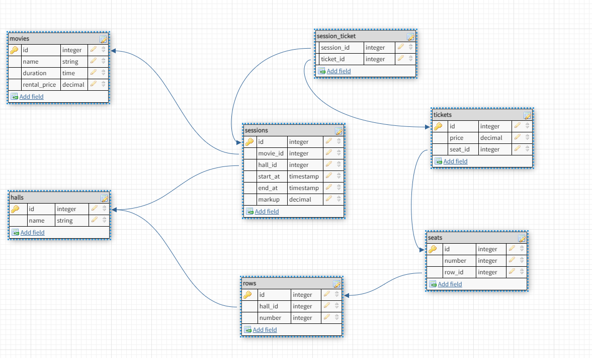

# PHP_2022

### Основные понятия баз данных
#### HW8

## DDL Cinema

```sql 
CREATE TABLE `halls` (
                         `id` INT NOT NULL AUTO_INCREMENT,
                         `name` VARCHAR(255) NOT NULL UNIQUE,
                         PRIMARY KEY (`id`)
);

CREATE TABLE `sessions` (
                            `id` INT NOT NULL AUTO_INCREMENT,
                            `movie_id` INT NOT NULL,
                            `hall_id` INT NOT NULL,
                            `start_at` TIMESTAMP NOT NULL,
                            `end_at` TIMESTAMP NOT NULL,
                            `markup` DECIMAL NOT NULL,
                            PRIMARY KEY (`id`)
);

CREATE TABLE `movies` (
                          `id` INT NOT NULL AUTO_INCREMENT,
                          `name` VARCHAR(255) NOT NULL,
                          `duration` TIME NOT NULL,
                          `rental_price` DECIMAL NOT NULL,
                          PRIMARY KEY (`id`)
);

CREATE TABLE `tickets` (
                           `id` INT NOT NULL AUTO_INCREMENT,
                           `price` DECIMAL NOT NULL,
                           `seat_id` integer NOT NULL,
                           PRIMARY KEY (`id`)
);

CREATE TABLE `session_ticket` (
                                  `session_id` INT NOT NULL,
                                  `ticket_id` INT NOT NULL
);

CREATE TABLE `rows` (
                        `id` INT NOT NULL AUTO_INCREMENT,
                        `hall_id` INT NOT NULL,
                        `number` INT NOT NULL,
                        PRIMARY KEY (`id`)
);

CREATE TABLE `seats` (
                         `id` INT NOT NULL AUTO_INCREMENT,
                         `number` INT NOT NULL,
                         `row_id` INT NOT NULL,
                         PRIMARY KEY (`id`)
);

ALTER TABLE `sessions` ADD CONSTRAINT `sessions_fk0` FOREIGN KEY (`movie_id`) REFERENCES `movies`(`id`);

ALTER TABLE `sessions` ADD CONSTRAINT `sessions_fk1` FOREIGN KEY (`hall_id`) REFERENCES `halls`(`id`);

ALTER TABLE `tickets` ADD CONSTRAINT `tickets_fk0` FOREIGN KEY (`seat_id`) REFERENCES `seats`(`id`);

ALTER TABLE `session_ticket` ADD CONSTRAINT `session_ticket_fk0` FOREIGN KEY (`session_id`) REFERENCES `sessions`(`id`);

ALTER TABLE `session_ticket` ADD CONSTRAINT `session_ticket_fk1` FOREIGN KEY (`ticket_id`) REFERENCES `tickets`(`id`);

ALTER TABLE `rows` ADD CONSTRAINT `rows_fk0` FOREIGN KEY (`hall_id`) REFERENCES `halls`(`id`);

ALTER TABLE `seats` ADD CONSTRAINT `seats_fk0` FOREIGN KEY (`row_id`) REFERENCES `rows`(`id`);


```
## Best movies


```sql
SELECT
    movies.name AS Movie,
    COUNT(sessions.id) AS Sessions,
    COUNT(t.id) AS Tickets,
    SUM(t.price) AS Revenue
FROM sessions
JOIN movies ON sessions.movie_id = movies.id
JOIN session_ticket AS st ON sessions.id = st.session_id
JOIN tickets AS t ON st.ticket_id = t.id
GROUP BY Movie
ORDER BY Revenue DESC

```