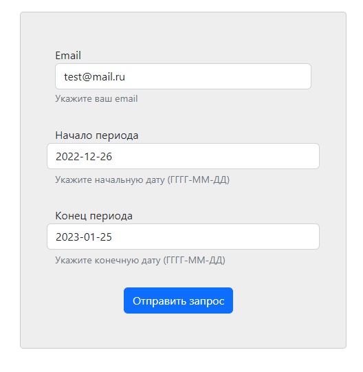
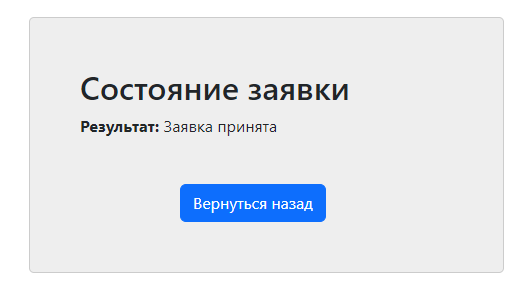
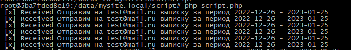

## Что это ?
Домашнее задание из курса ["Otus PHP Professional"](https://fas.st/wRyRs) №16, "Работа с очередью"

### Цель:
Мы научимся строить асинхронное приложение на практике.
Задача состоит в том, чтобы научиться применять очередь, увидеть её преимущества и недостатки.

### Описание/Пошаговая инструкция выполнения домашнего задания:
Пишем приложение обработки отложенных запросов.

- Создать простое веб-приложение, принимающее POST запрос из формы от пользователя. Например, запрос на генерацию банковской выписки за указанные даты.
Обычно такие запросы (в реальных системах) работают довольно долго, поэтому пользователя надо оповестить о том, что запрос принят в обработку
- Форма должна подразумевать отправку оповещения по результатам работы
- Передать тело запроса в очередь
- Написать скрипт, который будет читать сообщения из очереди и выводить информацию о них в консоль
- 4*. Реализация оповещения:
Сгенерированный ответ отправить через email или telegram
- Приложить инструкцию по запуску системы

### Критерии оценки:
- Работоспособность решения (5 баллов)
- Чистота кода (3 балла)
- Инструкции по развёртыванию системы (2 балла)

--------------------------------------------------------------------------

## Инструкция по деплойменту

```
# clone sources
mkdir hw16
git clone https://github.com/otusteamedu/PHP_2022.git
cd PHP_2022
git checkout MIkonnikov_hw16_queues

# add line '127.0.0.1 mysite.local' to your hosts file

# build project
mv .env.example .env
cd code && composer install 
docker-compose build
docker-compose up -d
```

--------------------------------------------------------------------------

## Инструкция по тестированию приложения

* Открываем сайт: 
http://mysite.local/

* Заполняем поля на mysite.local в форме и нажимаем кнопку "Отправить запрос":

 
* Получаем сообщение о том что заявка отослана: 


* Запускаем механизм получения сообщений из очереди:
```
# Заходим в docker контейнер php-fpm:
docker exec -it fpm_hw_12 bash
cd mysite.local/script
php script.php
```

* Теперь все новые отправленные заявки будут отображаться в консоли:
  
