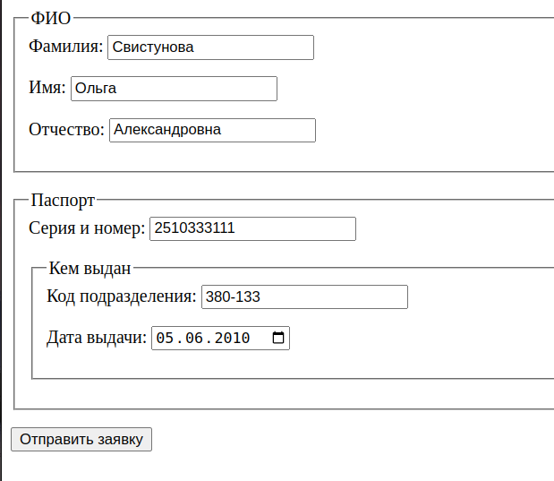

# HW20. Паттерны проектирования

Разработать небольшое приложение для работы с заявками на кредит, которое будет состоять из
3 независимых модулей:

## Модуль 1. Валидация формы

У вас есть форма, которая структурирована вот так:

* ФИО (составное поле)
    * фамилия (простое поле)
    * имя (простое поле)
    * отчество (простое поле)
* Паспорт (составное поле)
    * серия и номер (простое поле)
    * кем выдан (составное поле)
        * код подразделения (простое поле)
        * дата выдачи (простое поле)

Данные из этой формы приходят в виде вложенного массива.
Вам нужно выполнить валидацию этого массива, разработав:

* 4 валидатора (имя физлица, серия и номер паспорта, код подразделения, дата выдачи паспорта) — **Стратегия**
* 2 поля формы (простое или составное; в простое поле “встраивается” тот или иной валидатор) — **Компоновщик**
* фабрику для простых/составных полей формы — **Фабричный метод**

Вам также потребуется пример клиентского кода, в котором вы:

* создадите нужное кол-во полей формы (с соответствующими валидаторами)
* соберёте из них дерево
* запустите валидацию в корне этого дерева
* после успешной валидации отправляет сообщение через Диспетчер событий всем подписчикам (см. ниже)

## Модуль 2. Диспетчер событий

Вам нужно реализовать **Наблюдатель**, взяв за основу стандарт PSR-14 (https://www.php-fig.org/psr/psr-14/). Его
подписчиком
будет Шлюз (см. ниже).

## Модуль 3. Шлюз

Этот модуль работает с сущностью Заявка, которая физически хранится на другом микросервисе. Для работы с ней вам
потребуется:

* класс Заявки (2-3 любых поля, это не принципиально)
* **Прокси**, который будет “притворяться” Заявкой и при каждом изменении полей “отправлять” запросы во внешний
  миросервис (имитация http-запросов)
* дополнительный класс (сервис), который будет создавать эти Заявки

В итоге получится примерно такая схема:

* Модуль 1 выполняет валидацию и публикует событие в Модуль 2
* Модуль 2 перенаправляет событие подписчику в Модуле 3 (сервису)
* Модуль 3 берёт событие и создаёт на его основе Заявку

## Application
