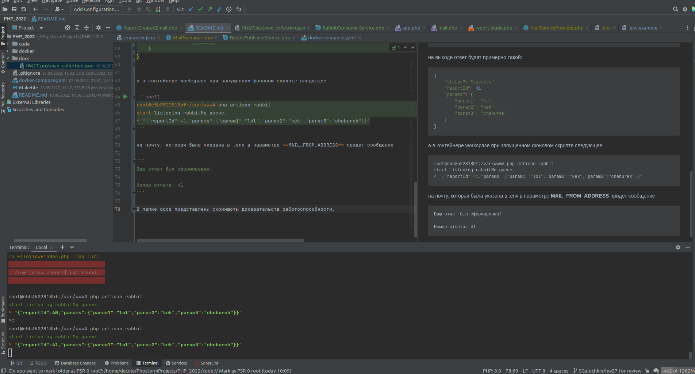
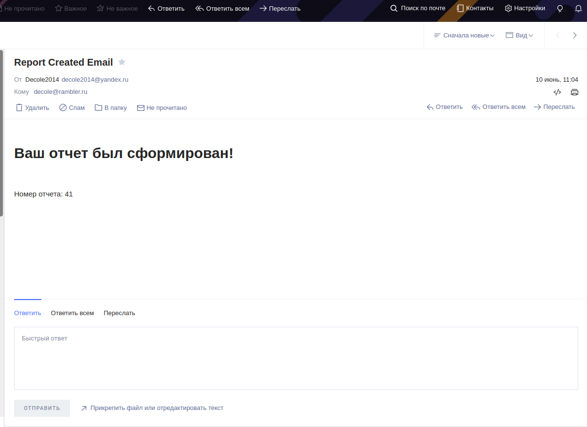

# PHP_2022

https://otus.ru/lessons/razrabotchik-php/?utm_source=github&utm_medium=free&utm_campaign=otus

## Описание/Пошаговая инструкция выполнения домашнего задания:
Пишем приложение обработки отложенных запросов.

1. Создать простое веб-приложение, принимающее POST запрос из формы от пользователя. Например, запрос на генерацию банковской выписки за указанные даты.

2. Обычно такие запросы (в реальных системах) работают довольно долго, поэтому пользователя надо оповестить о том, что запрос принят в обработку

3. Форма должна подразумевать отправку оповещения по результатам работы

4. Передать тело запроса в очередь

5. **Написать скрипт, который будет читать сообщения из очереди и выводить информацию о них в консоль** 

 - 4*. Реализация оповещения

6. Сгенерированный ответ отправить через email или telegram Приложить инструкцию по запуску системы


____________

# Инструкция и объяснения

1. Скопировать `.env.exampl`e в `.env`
2. Настроить почтовик под себя - указать логин, пароль и обязательно **MAIL_FROM_ADDRESS**
3. `make console` - внутри контейнера workspace запустить слушатель кролика `php artisan rabbit`
4. залить в Postman коллекцию из папки docs/HW27.postman_collection.json

по `http://application.local/v1/report/`

отправляем тело запроса 

```json
{
    "param1": "lol",
    "param2": "kek",
    "param3": "cheburek"
}
```

на выходе ответ будет примерно такой:

```json
{
    "status": "success",
    "reportId": 41,
    "params": {
        "param1": "lol",
        "param2": "kek",
        "param3": "cheburek"
    }
}
```

а в контейнере workspace при запущенном фоновом скрипте следующее

```shell
root@e5b3522818bf:/var/www# php artisan rabbit
start listening rabbitMq queue.
^ "{"reportId":41,"params":{"param1":"lol","param2":"kek","param3":"cheburek"}}"
```

на почту, которая была указана в .env в параметре **MAIL_FROM_ADDRESS** придет сообщение

```
Ваш отчет был сформирован!

Номер отчета: 41
```

В папке docs представлены скриншоты доказательств работоспособности.





