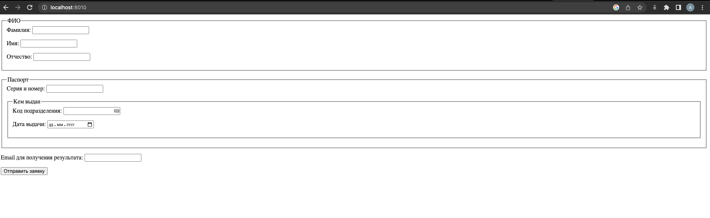
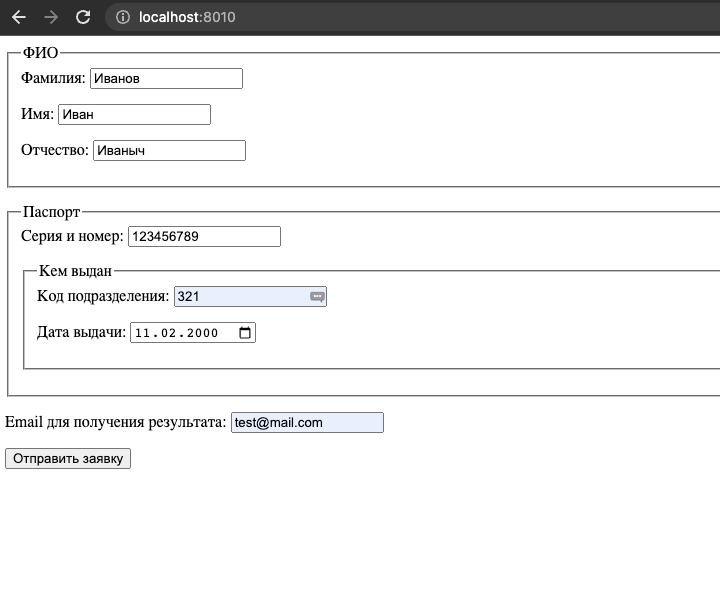

# PHP_2022

# ДЗ: Паттерны работы с данными

## Установка
- создать файл ```.env``` и скопировать в него все из ```env.example```
- из директории куда скачаны исходники выполнить ```docker-compose build```
- как сборка завершится, выполнить ```docker-compose -p 'otus-hw12' up -d```
- если все успешно, то буду созданы 3 контейнера:  
  
- также, нужно зайти в контейнер ```app-hw12``` и выполнить ```chmod +x start_search.php```

## Что сделано
- Был реализован паттерн ```Data Mapper```  
- Реализован метод получения всех записей таблицы  
- Реализован дополнительный паттерн ```Identity Map```  
- База данных postgres. Структура и данные взяты из ```ДЗ №8```  
- Инициализация БД подробно описана в ```ДЗ №8``` и ```№7```  
    
    
    
- За основу работы для текущего ДЗ взята таблица ```ticket```   
    

## Пример работы  
- Поиск конкретного билета:  
  
- Получение всех билетов:  
  
- Добавление нового билета:  
  
  
- Обновление билета:  
  
  
- Удаление конкретного билета:  
  