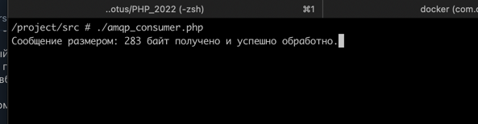

# PHP_2022
https://otus.ru/lessons/razrabotchik-php/?utm_source=github&utm_medium=free&utm_campaign=otus

## ДЗ: Работа с очередью

#### Описание/Пошаговая инструкция выполнения домашнего задания
Пишем приложение обработки отложенных запросов.

1. Создать простое веб-приложение, принимающее POST запрос из формы от пользователя. Например, запрос на генерацию банковской выписки за указанные даты.  
2. Обычно такие запросы (в реальных системах) работают довольно долго, поэтому пользователя надо оповестить о том, что запрос принят в обработку  
3. Форма должна подразумевать отправку оповещения по результатам работы  
4. Передать тело запроса в очередь  
5. Написать скрипт, который будет читать сообщения из очереди и выводить информацию о них в консоль    
5.1. Реализация оповещения  
6. Сгенерированный ответ отправить через email или telegram
7. Приложить инструкцию по запуску системы

#### Порядок запуска
1. Склонировать проект из репозитория  
2. Перейти в директорию с проектом и из консоли (терминала) выполнить ```docker-compose build```
3. Если все успешно, то выполнить ```docker-compose -p 'otus-hw16' up -d```
4. Если все успешно, будет создано 4-е контейнера:
  
5. Зайти в контейнер ```otus-hw16``` и выполнить ```cp .env.example .env```
6. В этом же контейнере выполнить ```composer install```
7. В этом же контейнере перейти в директорию ```src (cd src\)``` и выполнить ```chmod +x amqp_consumer.php```  
8. Приложение готово к эксплуатации.

#### Пример работы:
1. Открыть ```http://localhost:8010/```
   
2. Открыть ```http://localhost:15672/```. Ввести логин: ```guest```, пароль: ```guest```
  
3. Открыть ```http://localhost:1024/```
  
4. Заполнить форму и нажать кнопку "Отправить заявку"  
  
5. Если все ок, то откроется форма с подтверждением
  
6. В очереди появится сообщение
  
7. Чтобы прочитать сообщение и получить email открыть еще раз контейнер ```otus-hw16```, перейти в директорию ```src (cd src\)``` и выполнить ```./amqp_consumer.php```
  
8. Если все успешно, то сообщение будет прочитано из очереди и отправлено уведомление на почту
  
  
  
9. Консьюмер будет продолжать работать как демон, готовый читать следующие сообщения из очереди (для останова нажать ```Cmd+C (Mac)```, ```Ctrl+C (Linux/Windows)```)).
  