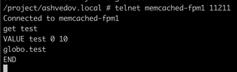

# PHP_2022
## Homework №4
1. Запустить из корня проекта ```docker-compose build```
2. Как будет собран образ, запустить ```docker-compose -p 'otus-hw4' up -d```
3. В файл ```hosts``` добавить: ```127.0.0.1 ashvedov.local```
4. Зайти в любой из контейнеров ```app-fpm1```, ```app-fpm2```, ```app-fpm3``` и выполнить ```composer install```
5. Если все успешно, то по адресу ```http://ashvedov.local:8005``` откроется сайт

- сайт открывается


- nginx-контейнеры


- демонстрация работы nginx балансера:


- демонстрация работы валидатора


- демонстрация работы кластера memcached (объединены в кластер при помощи ```mcrouter```)



