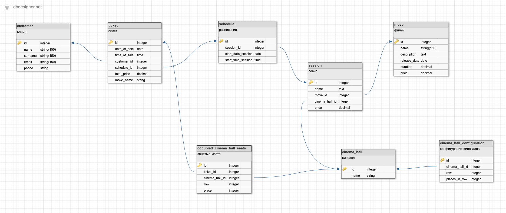
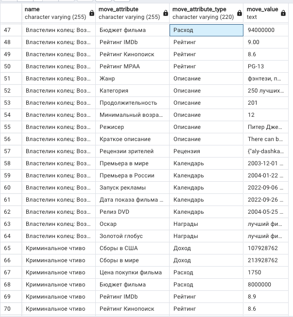

# PHP_2022
## ДЗ: Проектирование БД

- Из корня проекта выполнить - ```docker-compose -p 'otus-hw7' up -d```
- Должны создасться и стартануть два контейнера:

  (pgadmin добавлен для удобства - открывается по адресу: ```http://localhost:5050/browser/```)
- База инициализируется автоматически файлами:
  - ```Otus-hw7_postgres_create.sql``` - создание таблиц
  - ```test_data.sql``` - тестовые данные (заполение БД)
Если все ок, то БД готова:  


UML диаграмма БД (есть так же в pdf - директория summary):  


Вывод расписания:  


Самый прибыльнй фильм:  


Меняем данные, имитируя что на "Человека-паука" пошло не три, а четыре человека:
- было 3:  

- стало 4:  


Теперь фильм "Человек-паук" принес 1000 единц денег:  

