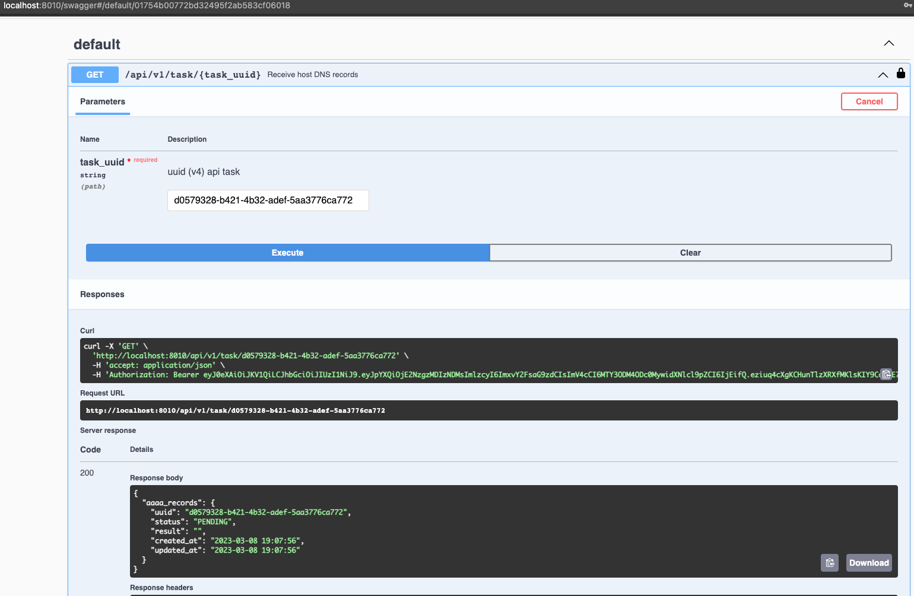

# PHP_2022

## ДЗ: API

### Цель
Научиться создавать универсальный интерфейс для различных потребителей (frontend фреймворки, мобильные приложения, сторонние приложения)  

### Описание/Пошаговая инструкция выполнения домашнего задания
- Необходимо реализовать Rest API с использованием очередей.  
- Ваши клиенты будут отправлять запросы на обработку, а вы будете складывать их в очередь и возвращать номер запроса.  
- В фоновом режиме вы будете обрабатывать запросы, а ваши клиенты периодически, используя номер запроса, будут проверять статус его обработки.  
- Разрешается:  
  - Использование Composer-зависимостей  
  - Использование микрофреймворков (Lumen, Silex и т.п.)  

### Приложение
- приложение выполняет поиск DNS записей (АААА)
- пользователь вводит доменное имя сайта (хост)
- через некоторое время получает АААА записи

### Стэк
- PHP 8.1
- Leaf PHP
- MySQL 8+
- Phinx (для миграций)
- RabbitMQ

### Запуск
- склонировать проект ```https://github.com/otusteamedu/PHP_2022/tree/AShvedov/hw17```
- перейти в диреткорию проекта, из директории проекта в ```/src```
- из директории ```/src``` выполнить последовательно ```cp .env.example .env```, ```docker-compose build```, ```docker-compose -p 'otus-hw17' up -d```
- если все успешно, то будет создано 5 контейнеров  
  
- теперь нужно зайти в контейнер ```otus-hw17``` и выполнить ```composer install```  
- если все успешно, то в браузере по пути ```http://localhost:8010/``` откроется приветственное окно  
  
- затем из этого же контейнера последовательно выполнить ```./vendor/bin/phinx migrate -e development```, ```./vendor/bin/phinx seed:run -e development```
- если все успешно, то открыть phpmyadminer по пути ```http://localhost:9991/``` (сервер: ```db-hw17```, имя пользователя: ```admin```, пароль: ```root```) будет доступна БД:  
  
  
  
  
- из этого же контейнера выполнить ```chmod +x amqp_consumer.php```  
- RabbitMQ должен быть доступен по адресу ```http://localhost:15672/``` (username: ```guest```, password: ```guest```)  
  
- Документация по API доступна по адресу ```http://localhost:8010/swagger``` (для авторизации - username: ```developer```, password: ```bitnami```)
  

### Проверка работы
- Работу приложения можно проверить из документации API - ```http://localhost:8010/swagge```
- Нужно сначала авторизоваться
  
  
- Затем у ```endpoint``` ```/api/v1/dns-records/{host}``` нажать ```Try it out```
  
- ввести любое доменное имя и нажать ```execute```
  
- система выдала ```uuid``` апи задачи
  
- задача добавилась в очередь
  
- проверим выполнение задачи не запуская консьюмер  
  
- запустим консьюмер: для этого открыть в новой вкладке терминала контейнер ```otus-hw17``` и выполнить ```./amqp_consumer.php```  
  
- проверим результат работы апи задачи  
  