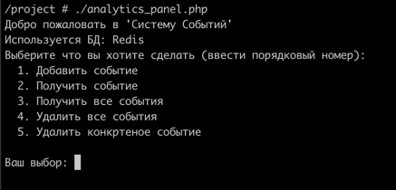

# PHP_2022

### Верификатор реализован как composer-библиотека:
```
https://github.com/DaaN88/php-email-validator
```

### Для проверки создан простой докер файл:
- Запустить из корня проекта ```docker-compose build```;
- Как будет собран образ, запустить ```docker-compose -p 'otus-hw5' up -d```;
- Зайти в любой из контейнеров ```app``` и выполнить ```composer install```;
- Если все успешно, то по адресу ```http://localhost:8011``` откроется страница ```index.php```:


Добавлять удалить email для проверки можно также в файле index.php.
