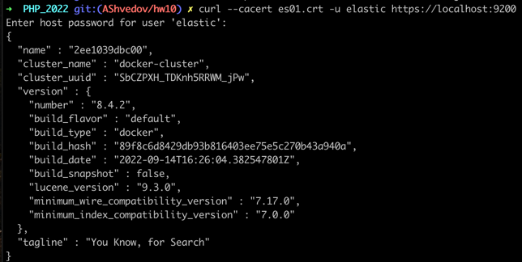
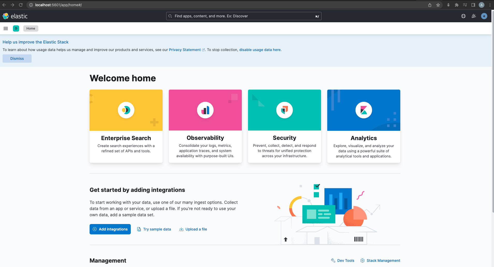

# PHP_2022

# ДЗ: ElasticSearch
[текст ДЗ](fixtures/hw-10.md)

## Создание и запуск контейнеров
- создать ```.env``` файл на базе ```.env.example``` (указать нужно только пароли)  
- из дирекотрии с проектом выполнить: ```docker-compose build```  
- когда ```build``` отработает, выполнить: ```docker-compose -p 'otus-hw10' up -d```  
- если все успешно, то стартанут контейнеры:
  
- не заходя ни в какой контейнер, из директории проекта выполнить: ```docker cp es01:/usr/share/elasticsearch/config/certs/es01/es01.crt .```
- если появился сертифкат ```es01.crt``` в директории проекта, для проверки что все хорошо, выполнить: ```curl --cacert es01.crt -u elastic https://localhost:9200```
  
- на требование ввести пароль, набрать пароль который был указан в .env для параметра ```ELASTIC_PASSWORD=```
  
- Однако, чтобы заработала ```kibana```, нужно пароли сгенерировать из контейнера с ```elasticsearch``` (в данном случае, это ```es01```)
  
- зайти в контейнер ```docker exec -it es-01 /bin/sh```  
- в контейнере выполнить ```./bin/elasticsearch-setup-passwords interactive```  
- будет предложено создать пароли (в целях разработки можно задать теже пароли которые в ```.env``` для всех запрашиваемых юзеров):
  
- для входа в ```kibana``` использовать логин ```elastic``` и соответствующий данному логину пароль  
- если нужно что-то тестировать из ```Postman```, то в самом ```Postman```, в настройках авторизации выбрать ```Basic auth```:
  

## Создание индекса и заполенение индекса данными
- Из контейнера ```fpm-hw10```, выполнить: ```curl --cacert es01.crt -u elastic:password --request PUT 'https://es01:9200/otus-hw10' --header 'Content-Type: application/json' --data-binary "@elasticsearc
  h-settings/mapping.json"```  
```password``` здесь тот который использован в ```.env``` (или тот который был переопределен при командой ```./bin/elasticsearch-setup-passwords interactive```)  
- чтобы заполнить индекс данными, выполнить из этого же контейнера: ```curl --cacert es01.crt -u elastic:rootqwerty --request POST 'https://es01:9200/otus-hw10/_bulk' --header 'Content-Type: application/json' --data-binary "@fixtu
  res/books-hw10.json"```  
И если все ок, то в Postman можно выполнить ```_search``` и убедиться что данные в индексе есть:  


## Запуск приложения
- сделать исполняемым скрипт: из корня проекта выполнить ```chmod +x app.php```
- теперь можно запускать скрипт как ```./app.php <parameters>```

### Как пользоваться
- зайти в контейнер ```fpm-hw10```
- в контейнере набрать ```./app.php```
- появится меню, с выбором параметров:  
  
- путем ввода соответствующих номеров пунктов меню выбирается поле по которому нужно произвести поиск
- после выбора пункта меню и ввода значения, будет предложено либо завершить (любой символ, кроме символов продолжения), либо продолжить (y, yes, д, да) выбор еще полей для поиска
- по окончанию выбора будет предложено ввести количество выводимых результатов (в переделах от 1 до 10 000; по умолчанию 10):  
  
- если нужно произвести поиск по нескольким полям, то нужно просто продолжить выбор параметров:
  

### пример работы приложения:
  