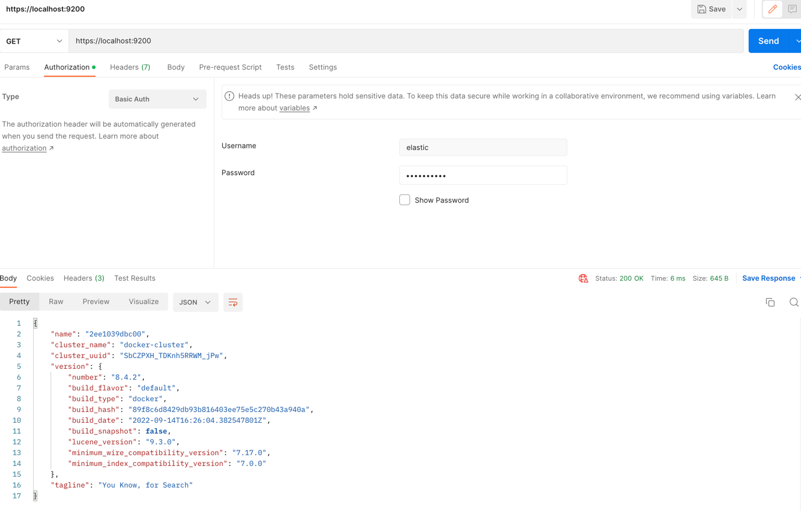

# PHP_2022

#### Requirements
- Docker

#### Usage
- из корня проекта выполнить ```docker-compose build```, затем ```docker-compose -p 'otus-hw6' up -d```
- создадутся два контейнера:

- сервер запускать из ```app-server-hw6```, клиента соответственно из ```app-client-hw6```
- команды на запуск:
  - ```php app.php server```
  - ```php app.php client``` соответственно


- команды на останов:
  - остановить только клиента - ```stop``` (сервер остается работать)
  - остановить клиента и сервер - ```close:connection```



#### Пример работы


