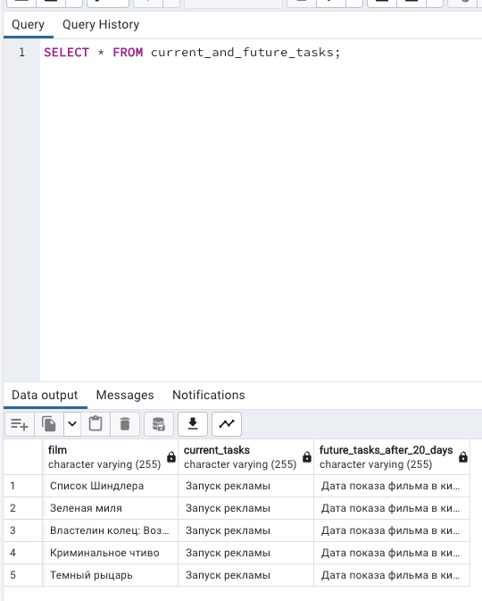
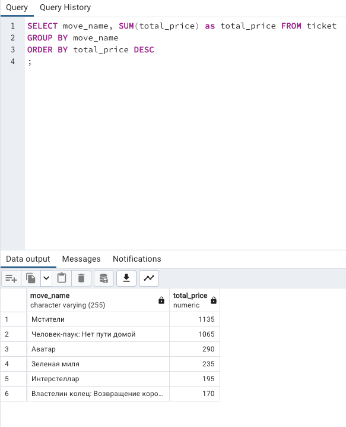

# PHP_2022
## ДЗ: Проектирование БД

- Из корня проекта выполнить - ```docker-compose -p 'otus-hw7' up -d```
- Должны создасться и стартануть два контейнера:

  (pgadmin добавлен для удобства - открывается по адресу: ```http://localhost:5050/browser/```)
- База инициализируется автоматически файлами:
  - ```Otus-hw7_postgres_create.sql``` - создание таблиц
  - ```test_data.sql``` - тестовые данные (заполение БД)

В самый первый запуск, в pgadmin нужно создать сервер:  
  
Задать имя:  
  
В host указать имя контейнера БД (не контейнера pgadmin!):  
  
Если данных в таблиц нет, то выбрать БД, вызвать query tool:  
  
затем скопировать все из файла ```test_data.sql``` и вставить в окно SQL запросов pgadmin.

Если все ок, то БД готова:  


UML диаграмма БД (есть так же в pdf - директория summary):  


Вывод сеансов фильмов и цен за сеанс и за фильм:  


Прибыль по всем фильмам, начиная с самого прибыльного:


Самый прибыльный фильм:  


Меняем данные, имитируя что на "Мстителей" пошло не три, а четыре человека:
- было 3:  

- стало 4:  


Теперь фильм "Мстители" принес 1525 едениц денег:  

