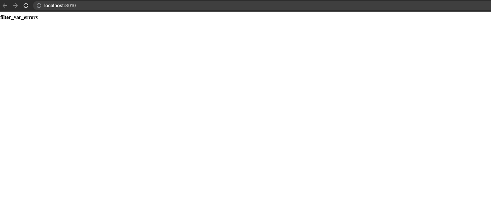

# PHP_2022

### ДЗ: Анализ кода

За основу взят верификатор email-адреса из задания № 5 (ДЗ: Ещё одно приложение).  
При рефакторинге использована чистая архитектура.  
В директории CodeBefore указан код написанный на момент выполенния задания # 5.  

### Для проверки:
- Запустить из корня проекта ```docker-compose build```;
- Как будет собран образ, запустить ```docker-compose -p 'otus-hw13' up -d```;
- Зайти в контейнер ```app``` и выполнить ```composer install```;
- Если все успешно, то по адресу ```http://localhost:8010``` откроется страница ```index.php``` с результатом валидации указанного email:  
  

- Добавлять удалить email для проверки можно также в файле ```index.php```.

### UML-диаграмма:

