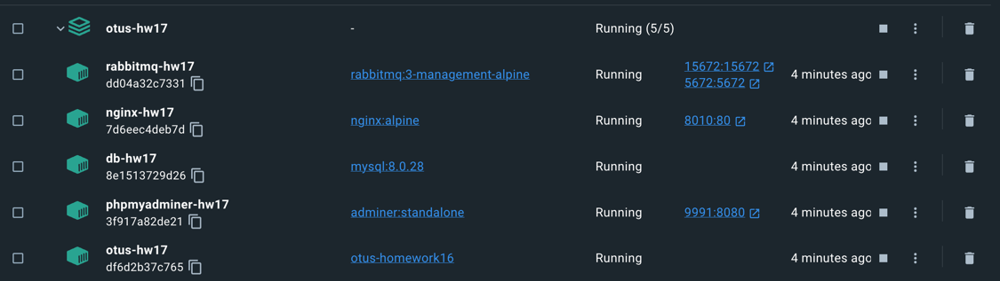

# PHP_2022

## ДЗ: API

### Цель
Научиться создавать универсальный интерфейс для различных потребителей (frontend фреймворки, мобильные приложения, сторонние приложения)  

### Описание/Пошаговая инструкция выполнения домашнего задания
- Необходимо реализовать Rest API с использованием очередей.  
- Ваши клиенты будут отправлять запросы на обработку, а вы будете складывать их в очередь и возвращать номер запроса.  
- В фоновом режиме вы будете обрабатывать запросы, а ваши клиенты периодически, используя номер запроса, будут проверять статус его обработки.  
- Разрешается:  
  - Использование Composer-зависимостей  
  - Использование микрофреймворков (Lumen, Silex и т.п.)  

### Запуск
- склонировать проект ```https://github.com/otusteamedu/PHP_2022/tree/AShvedov/hw17```
- перейти в диреткорию проекта, из директории проекта в ```/src```
- из директории ```/src``` выполнить последовательно ```cp .env.example .env```, ```docker-compose build```, ```docker-compose -p 'otus-hw17' up -d```
- если все успешно, то будет создано 5 контейнеров  
  
- теперь нужно зайти в контейнер ```otus-hw17``` и выполнить ```composer install```  
- если все успешно, то в браузере по пути ```http://localhost:8010/``` откроется приветственное окно  
  
- затем из этого же контейнера выполнить ```./vendor/bin/phinx migrate -e development```