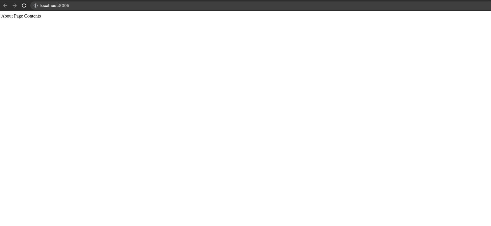

# PHP_2022  

# ДЗ: Redis  

### Установка
- создать файл ```.env``` и скопировать в него все из ```env.local```
- из директории куда скачаны исходники выполнить ```docker-compose build```
- как сборка завершится, выполнить ```docker-compose up -d```
- если все успешно, то будут созданы три контейнера:  
  
- убедиться что ```redis``` работает, можно зайдя в контейнер ```redis-hw11``` и там выполнить ```redis-cli```:  
  
- убедиться что работает ```memcached``` можнт зайди в контейнер ```otus-hw11``` и выполнить ```telnet memcached 11211```:   
  
- убедиться, что работает ```nginx можно```, открыв в браузере адрес ```http://localhost:8005```:  
  

### Использование
- зайдя в контейнер ```otus-hw11``` выполнить ```chmod +x analytics_panel.php```