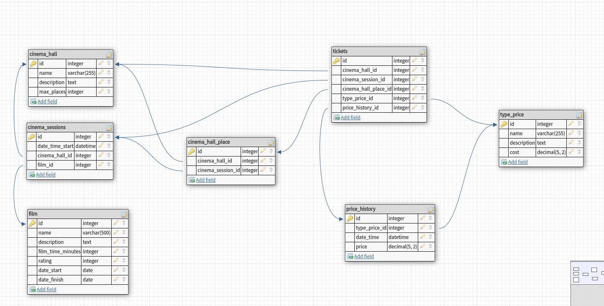

# PHP_2022

https://otus.ru/lessons/razrabotchik-php/?utm_source=github&utm_medium=free&utm_campaign=otus

### Выводы по архитектуре:

1.Созданая архитектура БД, не оптимальна, много транзитивных связей и зависимостей. Сильно усложнилась генерация тестовых данных. Принял решение сразу изменить архитектуру на получше. 

2. Переработал архитектуру БД. Убрал транзитивные зависимости.

### Выводы по домашнему заданию:

# Настройки по работе с PgAdmin

## PgAdmin (адрес и креды для PgAdmin)
 - URL: http://localhost:8081/   
 - login: admin@admin.com
 - password: root

## Connection settings:  (Настройки для PgAdmin контейнера)
 - Host: postgres
 - Port: 5432
 - DB: cinema
 - Username: root
 - Password: root

