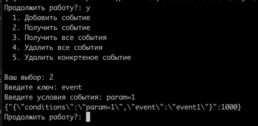
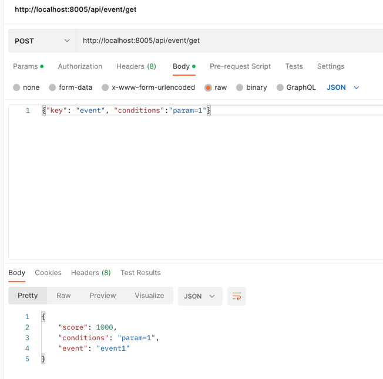

# PHP_2022  

# ДЗ: Redis  

### Установка
- создать файл ```.env``` и скопировать в него все из ```env.local```
- из директории куда скачаны исходники выполнить ```docker-compose build```
- как сборка завершится, выполнить ```docker-compose up -d```
- если все успешно, то будут созданы три контейнера:  
  
- убедиться что ```redis``` работает, можно зайдя в контейнер ```redis-hw11``` и там выполнить ```redis-cli```:  
  
- убедиться что работает ```memcached``` можнт зайди в контейнер ```otus-hw11``` и выполнить ```telnet memcached 11211```:   
  
- убедиться, что работает ```nginx можно```, открыв в браузере адрес ```http://localhost:8005```:
  

### Настройка
- зайдя в контейнер ```otus-hw11``` выполнить ```chmod +x analytics_panel.php```
- Доступна работа с двумя NoSQL БД - ```Memcached``` и ```Redis```. Переключение осуществляется путем изменения значения параметра ```repository``` в конфиг. файле ```app\src\config\common.php```  

### Взаимодействие с системой  
- Работа с системой возможна через ```HTTP API``` и ```Cli API```
- Для работы через командную строку нужно зайти в контейнер ```otus-hw11``` и выполнить ```./analytics_panel.php```. Дальше просто выбирать пункты пределагаемые системой  
- Для работы через ```HTTP API``` предусмотрены следующие ```url```:
- ```/api/event/add``` - добавление события: ```{"key":"event", "score":1000, "conditions":"param=1,param=2", "event_description":"event1"}```  
- ```/api/event/get``` - получения конкретного события: ```{"key":"event", "conditions":"param=1,param=2", "event_description":"event1"}```  
- ```/api/event/get_all``` - получения всех добавленных событий: ```{"key":"event"}```  
- ```/api/event/delete``` - удаление конкретного события: ```{"key":"event", "conditions":"param=1,param=2", "event_description":"event1"}```  
- ```/api/event/delete_all``` - удаление всех событий: ```{"key":"event"}```  
- Все запросы и ответы от ```HTTP API``` в ```JSON```
- Результатом поиска и удаления всегда будет событие соответствуюшие заданным условиям поиска, но с максимальным рангом (```score```)  


### Примеры работы через консольное приложение
- Начало:  
  
- Событий нет:  
  
- Начинаем добавлять:  
  
- Продолжаем:  
,  
  
- Проверяем что события добавлены:  
  
- Получаем событие:  
   
  
- Удалим второе событие:  
  
- Удалим все события:  
  

### Примеры работы через HTTP API  
- Переключимся на Memcached (проверим через консольное приложение):  
  
- Проверием что событий нет:  
  
- Начинаем добавлять:  
  
- Продолжаем:  
  
  
- Проверяем что события добавлены:  
  
- Получаем событие:  
  
- Получаем другое событие:  
  
- Удаляем второе событие:  
  
- Проверяем:  
  
- Удалим все события:  
  
- Проверяем:  
  
