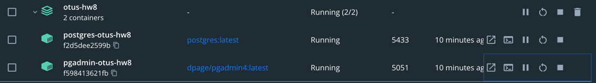
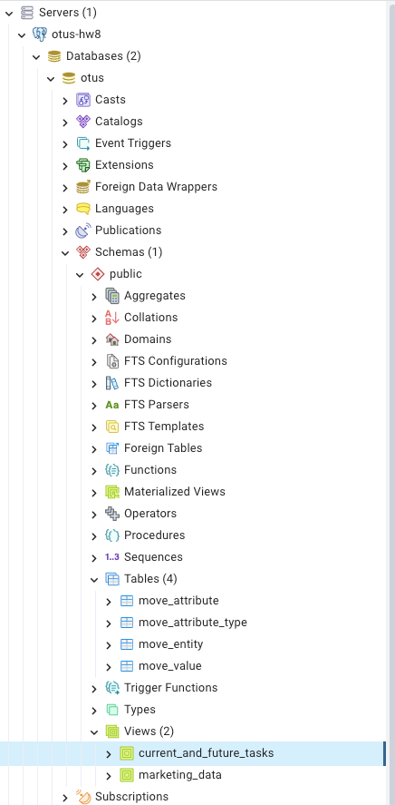
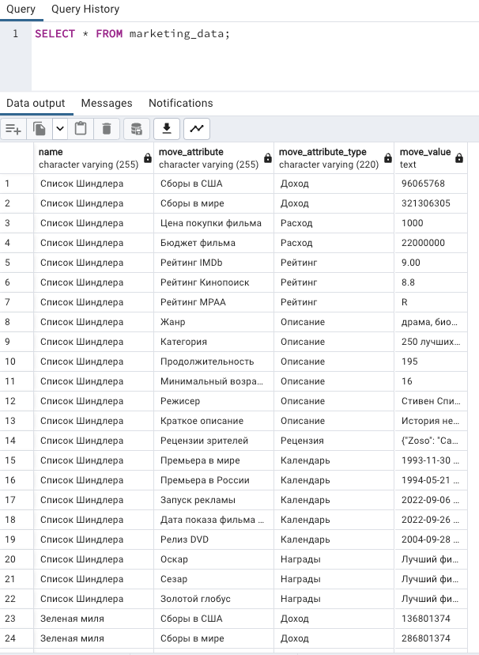
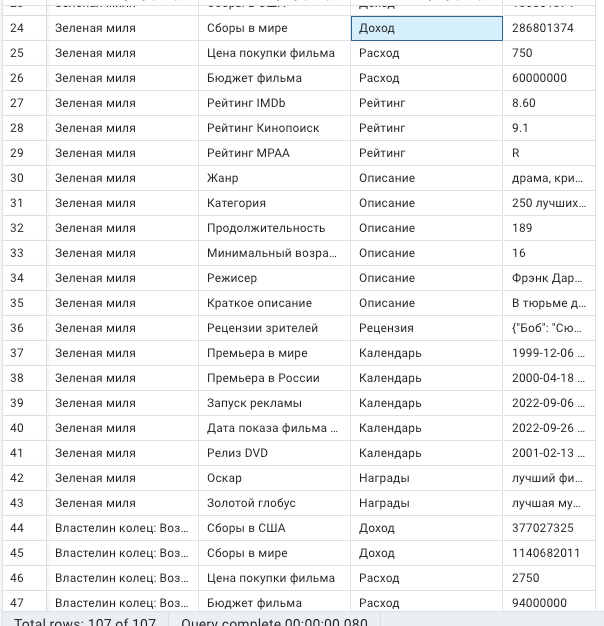
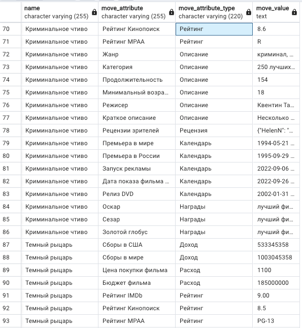

# PHP_2022

# ДЗ: EAV модель

- Из корня проекта выполнить - ```docker-compose -p 'otus-hw8' up -d```;
- Должны создаться и стартануть два контейнера:  

- При первом открытии ```pgadmin``` база инициализируется автоматически, но нужно создать подключение сначала к базе. Подключеие создается аналогично ```AShvedov/hw7```;
- Файлы инициализации (в том числе и представления) находятся в директории ```docker-settings/postgresql```;
- Так как данные базы сохраняются в ```volume``` и используется в представлении current_date, то чтобы представление ```current_and_future_tasks``` правильно работало, нужно каждый новый день удалять ```volume``` базы данных (таким образом БД всегда будет инициализирована текущей датой).

Если все ок, то БД и представления готовы:


Результат выполнения представления на текущие и будущие задачи:  
  

Результат выполнения представления для маркетинга:
  
  
  
  

