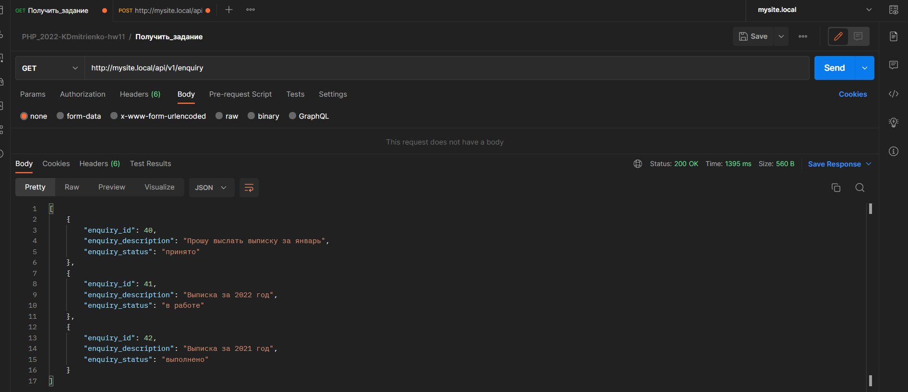
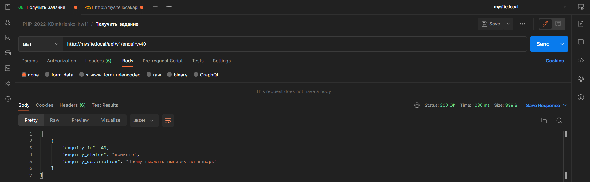
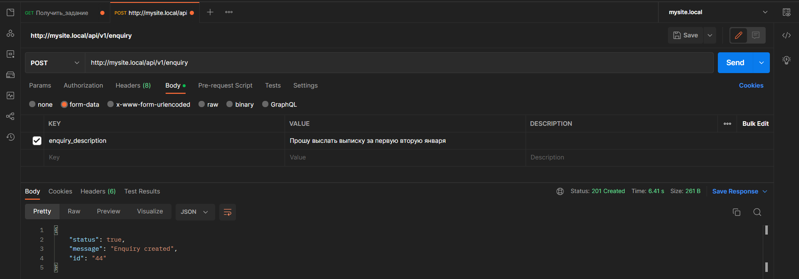
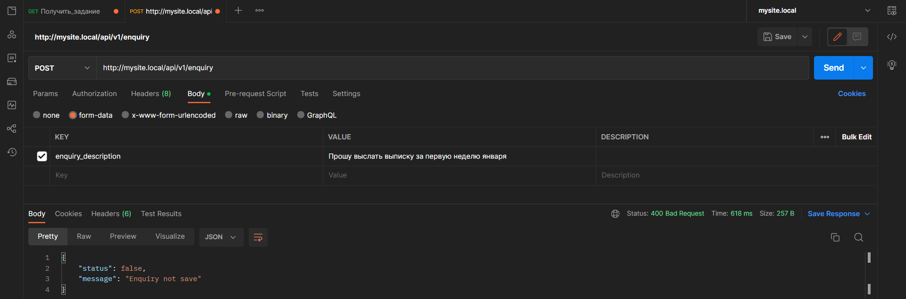
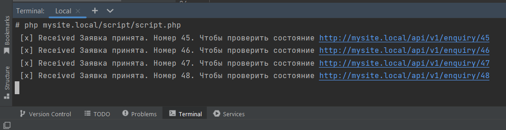

# Инструкция по запуску

Запустить приложение, используя Docker - [README](../README.md).

[Swagger документация по API (openapi v3)](openapi.yaml)

## Application

Запрос всех запросов:

Запрос информации по заявке используя ID:

Создание нового запроса:

Ошибка при создании нового запроса:

Для получения сообщения в очереди необходимо запустить скрипт:
1) Заходим контейнер app [php-fpm]
2) docker exec -ti {php_fpm_container} /bin/sh
3) php mysite.local/script/script.php

