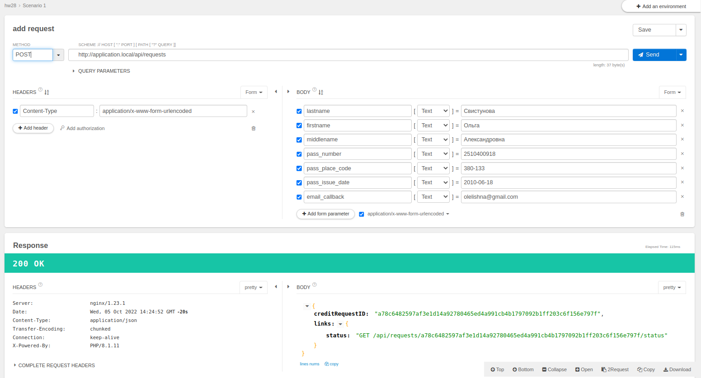
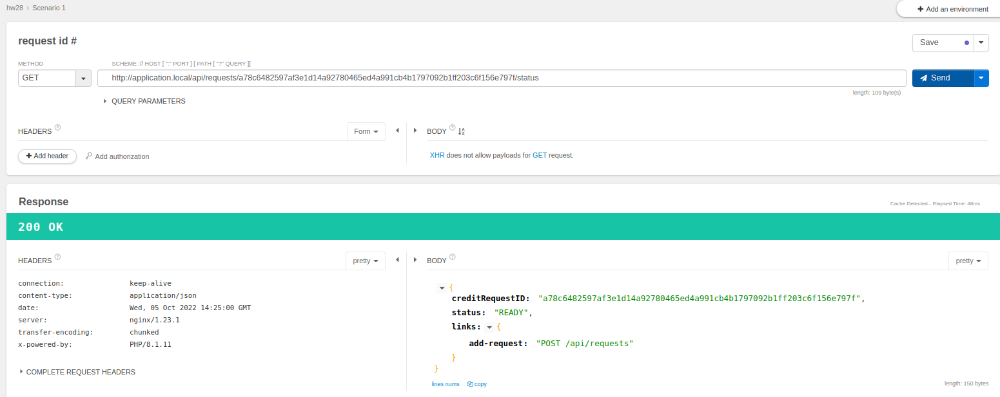
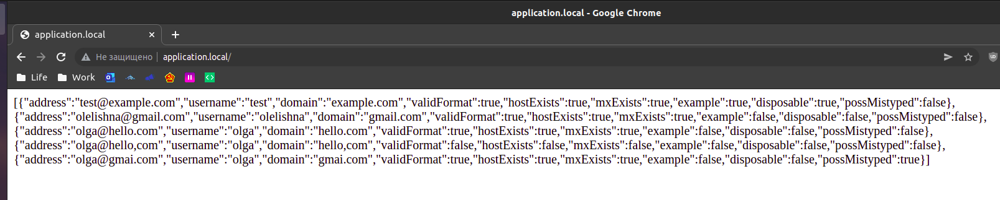
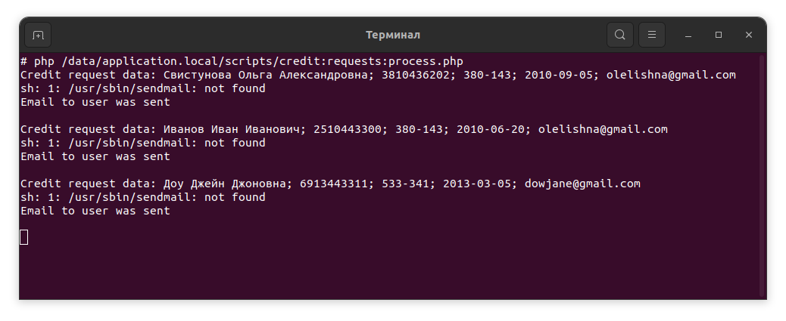

# Инструкция по запуску

Запустить приложение, используя докер.

Так как в контейнере app [php-fpm] для запуска php используется supervisord,
то скрипт для обработки очереди заявок запустится автоматически, однако, его
так же можно запустить, выполнив в консоли команду:

`php /data/application.local/current/scripts/credit:requests:process.php`

[API (openapi v3)](openapi.yaml)

## Application

