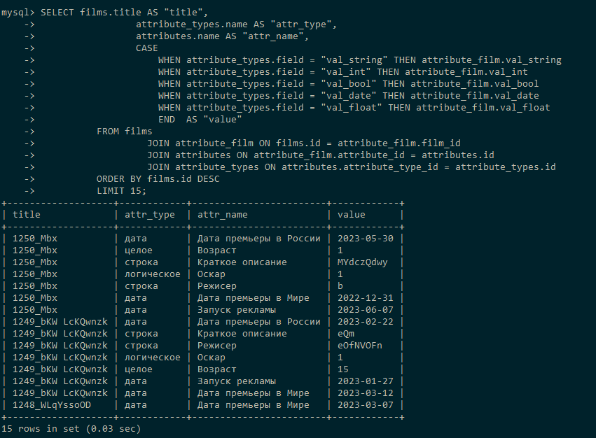
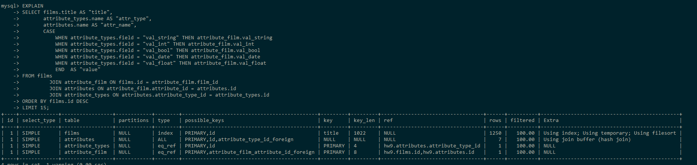
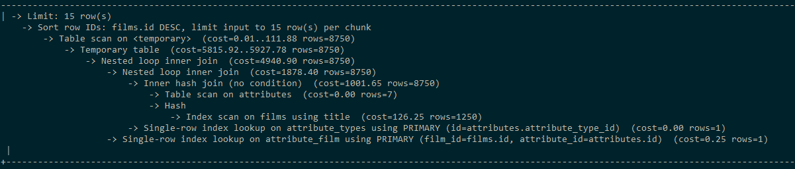
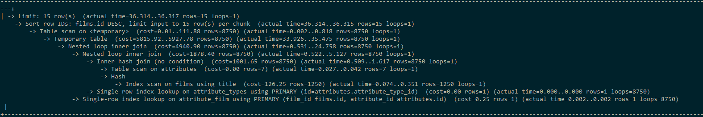
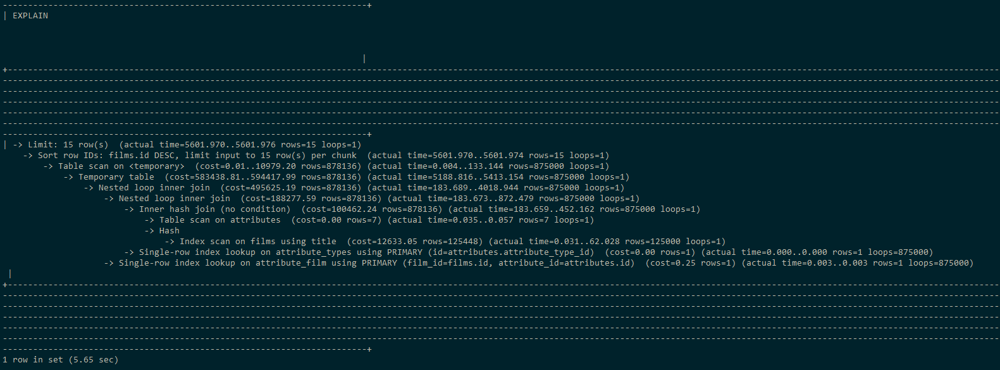
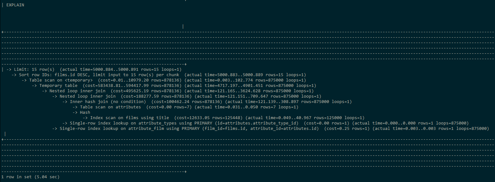
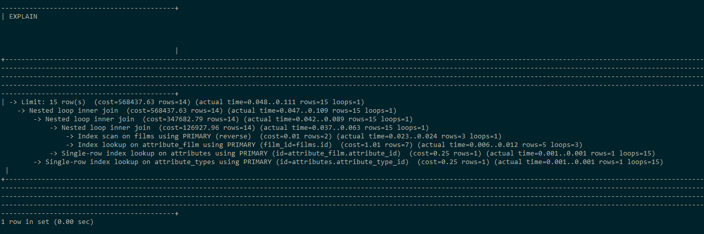

## Сбор служебных данных  для маркетинга: фильм, тип атрибута, атрибут, значение о конкретном фильме 
### (последние 15 строк)

```sql
SELECT films.title AS "title",
                 attribute_types.name AS "attr_type",
                 attributes.name AS "attr_name",
                 CASE
                     WHEN attribute_types.field = "val_string" THEN attribute_film.val_string
                     WHEN attribute_types.field = "val_int" THEN attribute_film.val_int
                     WHEN attribute_types.field = "val_bool" THEN attribute_film.val_bool
                     WHEN attribute_types.field = "val_date" THEN attribute_film.val_date
                     WHEN attribute_types.field = "val_float" THEN attribute_film.val_float
                     END  AS "value"
          FROM films
                   JOIN attribute_film ON films.id = attribute_film.film_id
                   JOIN attributes ON attribute_film.attribute_id = attributes.id
                   JOIN attribute_types ON attributes.attribute_type_id = attribute_types.id
          ORDER BY films.id DESC
          LIMIT 15;
```

### 10 000 записей

Результат: 15 строк.



#### Анализ:

Табличный вывод:

```sql
EXPLAIN
SELECT films.title AS "title",
       attribute_types.name AS "attr_type",
       attributes.name AS "attr_name",
       CASE
           WHEN attribute_types.field = "val_string" THEN attribute_film.val_string
           WHEN attribute_types.field = "val_int" THEN attribute_film.val_int
           WHEN attribute_types.field = "val_bool" THEN attribute_film.val_bool
           WHEN attribute_types.field = "val_date" THEN attribute_film.val_date
           WHEN attribute_types.field = "val_float" THEN attribute_film.val_float
           END  AS "value"
FROM films
         JOIN attribute_film ON films.id = attribute_film.film_id
         JOIN attributes ON attribute_film.attribute_id = attributes.id
         JOIN attribute_types ON attributes.attribute_type_id = attribute_types.id
ORDER BY films.id DESC
LIMIT 15;
```



Вывод дерева:

```sql
EXPLAIN FORMAT=TREE
SELECT films.title AS "title",
       attribute_types.name AS "attr_type",
       attributes.name AS "attr_name",
       CASE
           WHEN attribute_types.field = "val_string" THEN attribute_film.val_string
           WHEN attribute_types.field = "val_int" THEN attribute_film.val_int
           WHEN attribute_types.field = "val_bool" THEN attribute_film.val_bool
           WHEN attribute_types.field = "val_date" THEN attribute_film.val_date
           WHEN attribute_types.field = "val_float" THEN attribute_film.val_float
           END  AS "value"
FROM films
         JOIN attribute_film ON films.id = attribute_film.film_id
         JOIN attributes ON attribute_film.attribute_id = attributes.id
         JOIN attribute_types ON attributes.attribute_type_id = attribute_types.id
ORDER BY films.id DESC
LIMIT 15;
```



```sql
EXPLAIN ANALYZE
SELECT films.title AS "title",
       attribute_types.name AS "attr_type",
       attributes.name AS "attr_name",
       CASE
           WHEN attribute_types.field = "val_string" THEN attribute_film.val_string
           WHEN attribute_types.field = "val_int" THEN attribute_film.val_int
           WHEN attribute_types.field = "val_bool" THEN attribute_film.val_bool
           WHEN attribute_types.field = "val_date" THEN attribute_film.val_date
           WHEN attribute_types.field = "val_float" THEN attribute_film.val_float
           END  AS "value"
FROM films
         JOIN attribute_film ON films.id = attribute_film.film_id
         JOIN attributes ON attribute_film.attribute_id = attributes.id
         JOIN attribute_types ON attributes.attribute_type_id = attribute_types.id
ORDER BY films.id DESC
LIMIT 15;
```



### 1 000 000 записей



Создан индекс

```sql
CREATE INDEX idx_title
ON films (title);
```



Время уменьшилось.

Создан индекс

```sql
CREATE INDEX idx_marketing
ON attribute_film (val_date, val_string(255), val_int, val_float, val_bool);
```

Индекс никак не ускорил выполнение запроса и удален.

Созданы раздельные индексы.

```sql
CREATE INDEX idx_val_date
ON attribute_film (val_date);
```

```sql
CREATE FULLTEXT INDEX idx_val_string
ON attribute_film (val_string);
```

```sql
CREATE INDEX idx_val_int
ON attribute_film (val_int);
```

```sql
CREATE INDEX idx_val_float
ON attribute_film (val_float);
```

```sql
CREATE INDEX idx_val_bool
ON attribute_film (val_bool);
```

Удалось ускорить.
