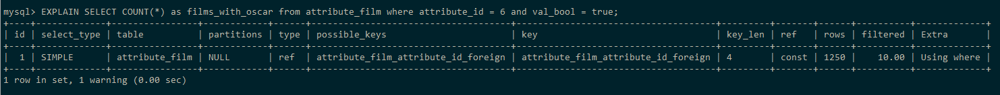

## Число фильмов с оскаром

```sql
SELECT COUNT(*) AS films_with_oscar
FROM attribute_film
WHERE attribute_id = 6
  AND val_bool = true;
```

### 10 000 записей

Результат: 1 строка.


#### Анализ:

Табличный вывод:

```sql
EXPLAIN
SELECT COUNT(*) AS films_with_oscar
FROM attribute_film
WHERE attribute_id = 6
  AND val_bool = true;
```



Вывод дерева:

```sql
EXPLAIN FORMAT=TREE
SELECT COUNT(*) AS films_with_oscar
FROM attribute_film
WHERE attribute_id = 6
  AND val_bool = true;
```


```sql
EXPLAIN ANALYZE
SELECT COUNT(*) AS films_with_oscar
FROM attribute_film
WHERE attribute_id = 6
  AND val_bool = true;
```


### 1 000 000 записей


Создан индекс
```sql
CREATE INDEX idx_val_bool
ON attribute_film (val_bool);
```


Итоговое время выполнения уменьшилось.