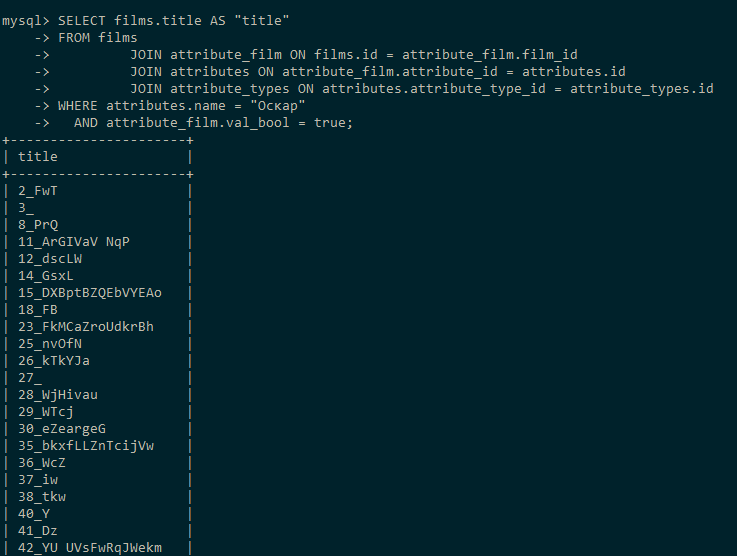
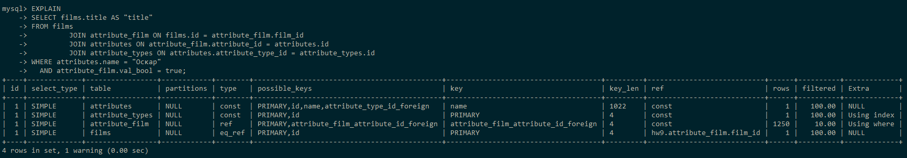
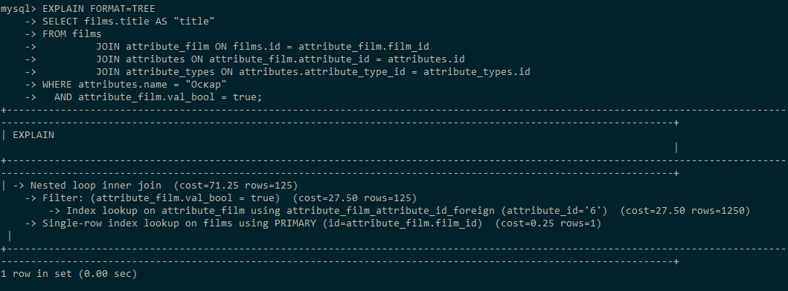
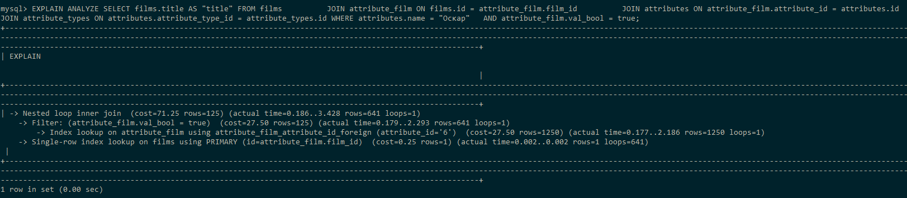

## Список фильмов с оскаром

```sql
SELECT films.title AS "title"
FROM films
         JOIN attribute_film ON films.id = attribute_film.film_id
         JOIN attributes ON attribute_film.attribute_id = attributes.id
         JOIN attribute_types ON attributes.attribute_type_id = attribute_types.id
WHERE attributes.name = "Оскар"
  AND attribute_film.val_bool = true;
```

### 10 000 записей

Результат: 641 строка. (На изображении только часть таблицы)



#### Анализ:

Табличный вывод:

```sql
EXPLAIN
SELECT films.title AS "title"
FROM films
         JOIN attribute_film ON films.id = attribute_film.film_id
         JOIN attributes ON attribute_film.attribute_id = attributes.id
         JOIN attribute_types ON attributes.attribute_type_id = attribute_types.id
WHERE attributes.name = "Оскар"
  AND attribute_film.val_bool = true;
```



Вывод дерева:

```sql
EXPLAIN FORMAT=TREE
SELECT films.title AS "title"
FROM films
         JOIN attribute_film ON films.id = attribute_film.film_id
         JOIN attributes ON attribute_film.attribute_id = attributes.id
         JOIN attribute_types ON attributes.attribute_type_id = attribute_types.id
WHERE attributes.name = "Оскар"
  AND attribute_film.val_bool = true;
```



```sql
EXPLAIN ANALYZE
SELECT films.title AS "title"
FROM films
         JOIN attribute_film ON films.id = attribute_film.film_id
         JOIN attributes ON attribute_film.attribute_id = attributes.id
         JOIN attribute_types ON attributes.attribute_type_id = attribute_types.id
WHERE attributes.name = "Оскар"
  AND attribute_film.val_bool = true;
```

