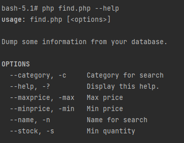
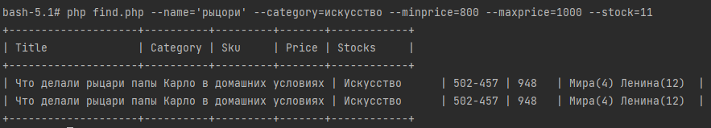

# Учебное задание OTUS по теме ElasticSearch

Это учебное API в рамках домашнего задания Otus. Реализовано консольное приложение, осуществляющее поиск по магазину книг.

## Установка

Запустить контейнеры, импортировать данные в через **Kibana** в индекс с именем **books**.

## Работа с командной строкой

Приложение поддерживает следующие команды:

### Пример вывода в консоль:

