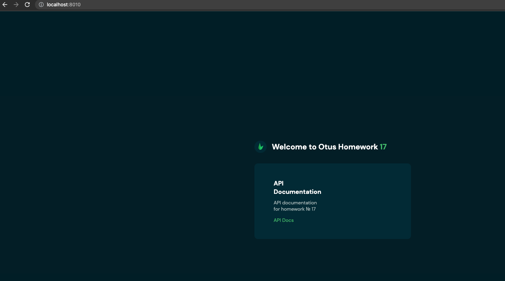
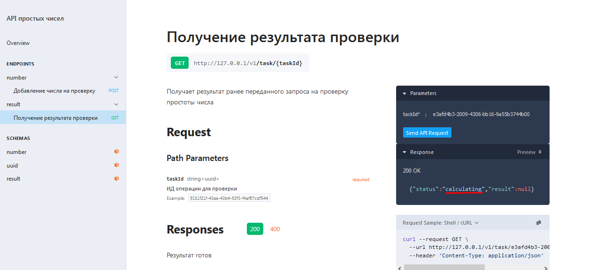

# Учебное задание OUTUS по теме API

Это учебное API в рамках домашнего задания Otus. Сервис берет целое число и осуществляет проверку на простоту. Задание ставится в очередь и результат доступен по ИД задания. 

В качестве фреймворка исползуется Lumen, база данных для хранения результатов - MySQL, сервер очередей - RabbitMQ.

## Установка

Запустить контейнеры, накатить миграции (php artisan migrate), запустить консьюмера (php artisan rabbitmq:consume).

## Работа с API

Интерактивная документация доступна по адресу 127.0.0.1 (или localhost) в зависимости от окружения:

Отправляем число в очередь на проверку (например, 1073676287 - чтобы было большое время просчета):

Здесь мы получили идентификатор задания, по которму проверяем результат. Как видно, простыми алгоритмами проверка осуществляется довольно долго:

По окончании вычислений мы получим финальный результат - число простое.

### Пример вывода в консоль:

