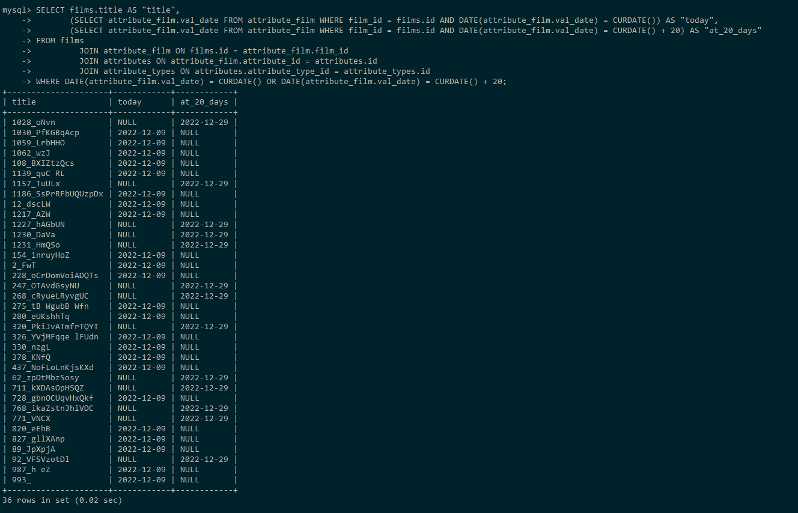

## Сбор служебных данных в форме: фильм, задачи актуальные на сегодня, задачи актуальные через 20 дней

```sql
SELECT films.title AS "title",
       (SELECT attribute_film.val_date FROM attribute_film WHERE film_id = films.id AND DATE(attribute_film.val_date) = CURDATE()) AS "today",
       (SELECT attribute_film.val_date FROM attribute_film WHERE film_id = films.id AND DATE(attribute_film.val_date) = CURDATE() + 20) AS "at_20_days"
FROM films
         JOIN attribute_film ON films.id = attribute_film.film_id
         JOIN attributes ON attribute_film.attribute_id = attributes.id
         JOIN attribute_types ON attributes.attribute_type_id = attribute_types.id
WHERE DATE(attribute_film.val_date) = CURDATE() OR DATE(attribute_film.val_date) = CURDATE() + 20;
```

### 10 000 записей

Результат: 36 строк.



#### Анализ:

Табличный вывод:

```sql
EXPLAIN
SELECT films.title AS "title",
       (SELECT attribute_film.val_date FROM attribute_film WHERE film_id = films.id AND DATE(attribute_film.val_date) = CURDATE()) AS "today",
       (SELECT attribute_film.val_date FROM attribute_film WHERE film_id = films.id AND DATE(attribute_film.val_date) = CURDATE() + 20) AS "at_20_days"
FROM films
         JOIN attribute_film ON films.id = attribute_film.film_id
         JOIN attributes ON attribute_film.attribute_id = attributes.id
         JOIN attribute_types ON attributes.attribute_type_id = attribute_types.id
WHERE DATE(attribute_film.val_date) = CURDATE() OR DATE(attribute_film.val_date) = CURDATE() + 20;
```


Вывод дерева:

```sql
EXPLAIN FORMAT=TREE
SELECT films.title AS "title",
       (SELECT attribute_film.val_date FROM attribute_film WHERE film_id = films.id AND DATE(attribute_film.val_date) = CURDATE()) AS "today",
       (SELECT attribute_film.val_date FROM attribute_film WHERE film_id = films.id AND DATE(attribute_film.val_date) = CURDATE() + 20) AS "at_20_days"
FROM films
         JOIN attribute_film ON films.id = attribute_film.film_id
         JOIN attributes ON attribute_film.attribute_id = attributes.id
         JOIN attribute_types ON attributes.attribute_type_id = attribute_types.id
WHERE DATE(attribute_film.val_date) = CURDATE() OR DATE(attribute_film.val_date) = CURDATE() + 20;
```


```sql
EXPLAIN ANALYZE
SELECT films.title AS "title",
       (SELECT attribute_film.val_date FROM attribute_film WHERE film_id = films.id AND DATE(attribute_film.val_date) = CURDATE()) AS "today",
       (SELECT attribute_film.val_date FROM attribute_film WHERE film_id = films.id AND DATE(attribute_film.val_date) = CURDATE() + 20) AS "at_20_days"
FROM films
         JOIN attribute_film ON films.id = attribute_film.film_id
         JOIN attributes ON attribute_film.attribute_id = attributes.id
         JOIN attribute_types ON attributes.attribute_type_id = attribute_types.id
WHERE DATE(attribute_film.val_date) = CURDATE() OR DATE(attribute_film.val_date) = CURDATE() + 20;
```


### 1 000 000 записей

Появились повторяющиеся даты, для того чтобы запрос отработал, необходимо добавить команду DISTINCT в подзапросы

```sql
EXPLAIN ANALYZE
SELECT films.title AS "title",
       (SELECT DISTINCT attribute_film.val_date FROM attribute_film WHERE film_id = films.id AND DATE(attribute_film.val_date) = CURDATE()) AS "today",
       (SELECT DISTINCT attribute_film.val_date FROM attribute_film WHERE film_id = films.id AND DATE(attribute_film.val_date) = CURDATE() + 20) AS "at_20_days"
FROM films
         JOIN attribute_film ON films.id = attribute_film.film_id
         JOIN attributes ON attribute_film.attribute_id = attributes.id
         JOIN attribute_types ON attributes.attribute_type_id = attribute_types.id
WHERE DATE(attribute_film.val_date) = CURDATE() OR DATE(attribute_film.val_date) = CURDATE() + 20;
```


Создан индекс
```sql
CREATE INDEX idx_title
ON films (title);
```


Итоговое время выполнения уменьшилось.

Создан индекс
```sql
ALTER TABLE attribute_film ADD INDEX idx_f_date_val_date((DATE(val_date)));
```


Время уменьшилось.


