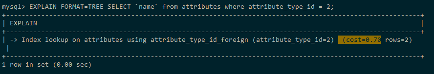
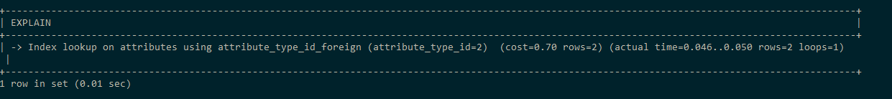

## Список названий атрибутов имеющих строковый тип

```sql
SELECT `name`
FROM attributes
WHERE attribute_type_id = 2;
```

### 10 000 записей

Результат: 2 строки.


#### Анализ:

Табличный вывод:

```sql
EXPLAIN 
SELECT `name`
FROM attributes
WHERE attribute_type_id = 2;
```


Вывод дерева:

```sql
EXPLAIN FORMAT=TREE
SELECT `name`
FROM attributes
WHERE attribute_type_id = 2;
```



```sql
EXPLAIN ANALYZE
SELECT `name`
FROM attributes
WHERE attribute_type_id = 2;
```


### 1 000 000 записей



Оптимизация не требуется.