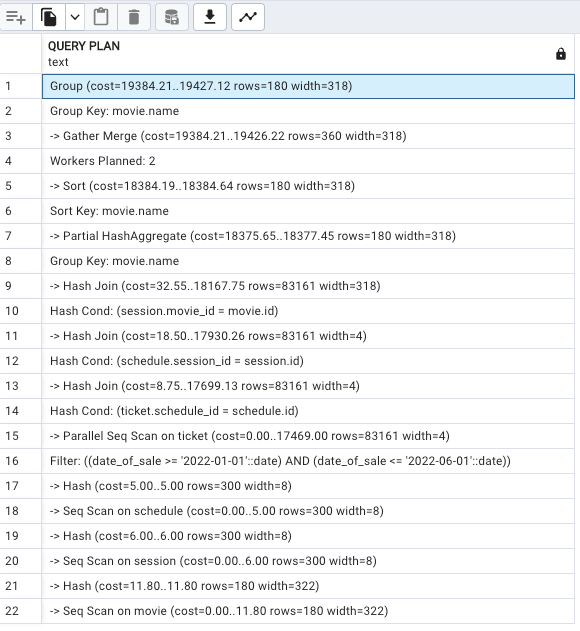
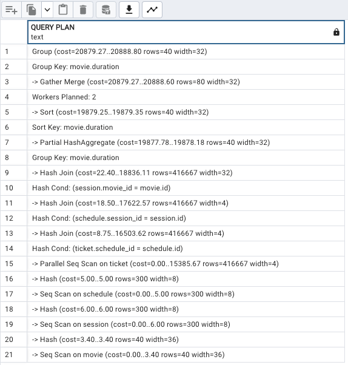
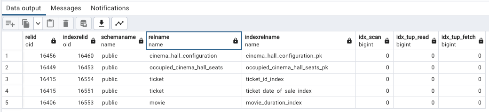

# ИССЛЕДОВАНИЕ ПРОИЗВОДИТЕЛЬНОСТИ ПРИ 1 0000 000 ЗАПИСЕЙ

## БЕЗ ИНДЕКСОВ

### ТРИ ПРОСТЫХ ЗАПРОСА

- 1: Выбор всех билетов у которых итоговая цена находится между 150 и 200 единиц денег:  
query: ```select * from ticket where total_price between 150 and 200;```   
explain: ```Gather  (cost=1000.00..18469.10 rows=1 width=58)```  
  
- 2: Выбор всех билетов у которых дата продажи равна 2022-07-25:  
query: ```select * from ticket where date_of_sale='2022-07-25';```  
explain: ```Gather  (cost=1000.00..17699.73 rows=2724 width=58)```
- 3: Выбор всех билетов которые проданы с 1 января 2022 года по март 2022 года и у которых цена больше 300:  
query: ```select * from ticket where total_price > 300 and date_of_sale between '2022-01-01' and '2022-03-30';```
explain: ```Gather  (cost=1000.00..21681.77 rows=21711 width=58)```  
  

### ТРИ СЛОЖНЫХ ЗАПРОСА

- 1: Вывод продолжительности всех фильмов на которые куплены билеты:  
query: ```select movie.duration as movie_duration from movie join session on movie.id = session.movie_id join schedule on session.id = schedule.session_id join ticket on schedule.id = ticket.schedule_id group by movie_duration;```  
explain: ```"Group  (cost=20806.36..20849.27 rows=180 width=32)```  
  
- 2: Вывод названий фильмов на которые куплены билеты в период с 1 января 2022 года по 1 июня 2022 года:  
query: ```select movie.name as movie_name from movie join session on movie.id = session.movie_id join schedule on session.id = schedule.session_id join ticket on schedule.id = ticket.schedule_id where ticket.date_of_sale between '2022-01-01' and '2022-06-01' group by movie.name;```  
explain: ```Group  (cost=19384.21..19427.12 rows=180 width=318)```  
  
- 3: Вывод самого продаваемого фильма:  
query: ```select count(movie.id) as movie_id, movie.name as movie_name from movie join session on movie.id = session.movie_id join schedule on session.id = schedule.session_id join ticket on schedule.id = ticket.schedule_id group by movie.id order by movie.name asc limit 1;```  
explain: ```"Limit  (cost=21894.53..21894.54 rows=1 width=330)```  
  

## С ИНДЕКСАМИ

### ТРИ ПРОСТЫХ ЗАПРОСА

- 1:
index: ```create index ticket_total_price_index on ticket using btree (total_price);```  
explain: ```Index Scan using ticket_total_price_index on ticket  (cost=0.42..8.45 rows=1 width=58)```  
  
За счет индекса удалось добиться снижения времени в ~2150 раз.
- 2:  
index: ```create index ticket_date_of_sale_index on ticket using btree (date_of_sale);```  
explain: ```"Bitmap Heap Scan on ticket  (cost=33.54..6394.82 rows=2724 width=58)"```  
  
За счет индекса удалось добиться снижения времени в ~2,76 раза.
- 3:  
index: ```create index ticket_date_of_sale_and_total_price_index on ticket using btree (date_of_sale, total_price);```  
explain: ```"Bitmap Heap Scan on ticket  (cost=340.40..11990.83 rows=21798 width=58)```  
  
За счет индекса удалось добиться снижения времени в ~1,8 раза.

### ТРИ СЛОЖНЫХ ЗАПРОСА  

- 1:
index: ```create index movie_duration_index on movie using btree(duration);```  
index: ```create index ticket_id_index on ticket using btree (id);```  
index: ```create index session_id_index on session using btree (id);```  
index: ```create index schedule_id_index on schedule using btree (id);```  
explain: ```"Group  (cost=20879.27..20888.80 rows=40 width=32)```  
  
Снижения времени поиска не произошло  
- 2:  
index: ```create index movie_name_index on movie using btree (name);```  
explain: ```"Group  (cost=17126.64..17136.17 rows=40 width=318)```  
  
Удалось получить незначительное снижение времени поиска  
- 3:  
index: ```create index movie_id_index on movie using btree (id);```  
explain: ```"Limit  (cost=21931.27..21931.27 rows=1 width=330)``` 
  
Снижения времени поиска не произошло  

### отсортированный список (15 значений) самых больших по размеру объектов БД (таблицы, включая индексы, сами индексы)
- query: ```SELECT table_name as object, pg_relation_size(quote_ident(table_name)) as size FROM information_schema.tables WHERE table_schema = 'public' UNION ALL SELECT indexname as object, pg_indexes_size(quote_ident(tablename)) as size FROM pg_indexes ORDER BY size DESC LIMIT 15;```  
  

### отсортированные списки (по 5 значений) самых часто и редко используемых индексов
- редко:  
query: ```SELECT * FROM pg_stat_user_indexes WHERE idx_scan = 0 ORDER BY relid DESC LIMIT 5;```  
  
- часто:  
query: ```SELECT * FROM pg_stat_user_indexes ORDER BY idx_scan DESC LIMIT 5;```  
  