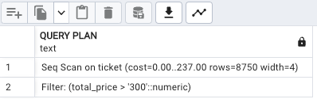
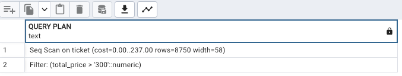
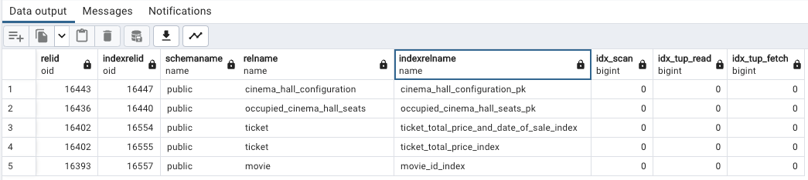

# ИССЛЕДОВАНИЕ ПРОИЗВОДИТЕЛЬНОСТИ ПРИ 10 000 ЗАПИСЯХ

## БЕЗ ИНДЕКСОВ

### ТРИ ПРОСТЫХ ЗАПРОСА

- 1: Выбор всех фильм у которых продолжительность больше 200 минут:  
query: ```select * from movie where duration > 200;```  
explain: ```Seq Scan on movie  (cost=0.00..12.25 rows=60 width=422)```

- 2: Выбор всех билетов у которых цена больше 300:  
query: ```select * from ticket where total_price > 300;```
explain: ```Seq Scan on ticket  (cost=0.00..237.00 rows=8750 width=4)```  

- 3: Выбор всех билетов которые проданы с 1 января 2022 года по март 2022 года и у которых цена больше 300:  
query: ```select * from ticket where total_price > 300 and date_of_sale between '2022-01-01' and '2022-03-30';```
explain: ```Seq Scan on ticket  (cost=0.00..287.00 rows=204 width=4)```  


### ТРИ СЛОЖНЫХ ЗАПРОСА  

- 1: Вывод продолжительности всех фильмов на которые куплены билеты:  
query: ```select movie.duration as movie_duration from movie join session on movie.id = session.movie_id join schedule on session.id = schedule.session_id join ticket on schedule.id = ticket.schedule_id group by movie_duration;```  
explain: ```HashAggregate  (cost=349.66..351.46 rows=180 width=32)```  

- 2: Вывод названий фильмов на которые куплены билеты в период с 1 января 2022 года по 1 июня 2022 года:  
query: ```select movie.name as movie_name from movie join session on movie.id = session.movie_id join schedule on session.id = schedule.session_id join ticket on schedule.id = ticket.schedule_id where ticket.date_of_sale between '2022-01-01' and '2022-06-01' group by movie.name;```  
explain: ```HashAggregate  (cost=315.61..317.41 rows=180 width=318)```  

- 3: Вывод самого продаваемого фильма:  
query: ```select count(movie.id) as movie_id, movie.name as movie_name from movie join session on movie.id = session.movie_id join schedule on session.id = schedule.session_id join ticket on schedule.id = ticket.schedule_id group by movie.id order by movie.name asc limit 1;```  
explain: ```Limit  (cost=377.36..377.36 rows=1 width=330)```  


## С ИНДЕКСАМИ  

### ТРИ ПРОСТЫХ ЗАПРОСА

- 1:  
index: ```create index movie_duration_index on movie using btree(duration);```  
explain: ```Seq Scan on movie  (cost=0.00..3.50 rows=13 width=422)```  

Время поиска уменьшилось в 4 раза.
- 2:  
index: ```create index ticket_total_price_index on ticket using btree(total_price);```  
explain: ```Seq Scan on ticket  (cost=0.00..237.00 rows=8750 width=58)```

Время поиска никак не изменилось.
- 3:
index: ```create index ticket_total_price_and_date_of_sale_index on ticket using btree (total_price, date_of_sale);```  
explain: ```Seq Scan on ticket  (cost=0.00..287.00 rows=204 width=58)```

Время поиска никак не изменилось.

### ТРИ СЛОЖНЫХ ЗАПРОСА  

- 1:  
index: ```create index movie_duration_index on movie using btree(duration);```
explain: ```HashAggregate  (cost=341.67..342.07 rows=40 width=32)```
  
Получили незначительное снижение времени поиска  
- 2:  
index: ```create index movie_name_index on movie using btree (name);```  
explain: ```HashAggregate  (cost=305.89..306.29 rows=40 width=318)```
  
Получили незначительно снижение времени запроса  
- 3:  
index: ```create index movie_id_index on movie using btree (id);```
explain: ```Limit  (cost=367.27..367.27 rows=1 width=330)```

Получили незначительное снижение времени запроса

### отсортированный список (15 значений) самых больших по размеру объектов БД (таблицы, включая индексы, сами индексы)
- query: ```SELECT table_name as object, pg_relation_size(quote_ident(table_name)) as size FROM information_schema.tables WHERE table_schema = 'public' UNION ALL SELECT indexname as object, pg_indexes_size(quote_ident(tablename)) as size FROM pg_indexes ORDER BY size DESC LIMIT 15;```  


### отсортированные списки (по 5 значений) самых часто и редко используемых индексов  
- редко:  
query: ```SELECT * FROM pg_stat_user_indexes WHERE idx_scan = 0 ORDER BY relid DESC LIMIT 5;```  
  
- часто:  
query: ```SELECT * FROM pg_stat_user_indexes ORDER BY idx_scan DESC LIMIT 5;```  
