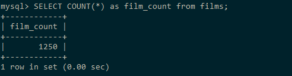
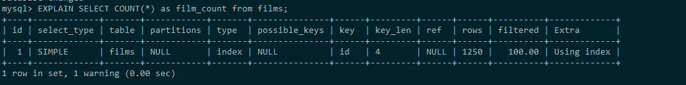
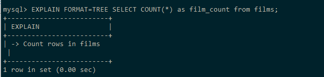
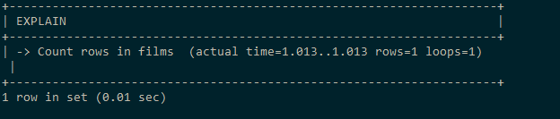
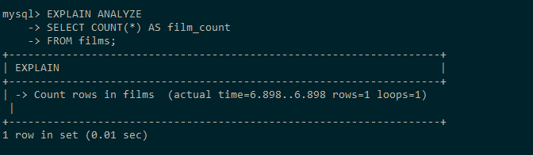

## Общее число фильмов

```sql
SELECT COUNT(*) AS film_count
FROM films;
```

### 10 000 записей

Результат: 1 строка (коичество фильмов 1250, т.к. 
на каждый фильм приходиться несколько атрибутов).



#### Анализ:

Табличный вывод:

```sql
EXPLAIN
SELECT COUNT(*) AS film_count
FROM films;
```



Вывод дерева:

```sql
EXPLAIN FORMAT=TREE
SELECT COUNT(*) AS film_count
FROM films;
```



```sql
EXPLAIN ANALYZE
SELECT COUNT(*) AS film_count
FROM films;
```



### 1 000 000 записей

EXPLAIN ANALYZE:



Оптимизация не требуется.